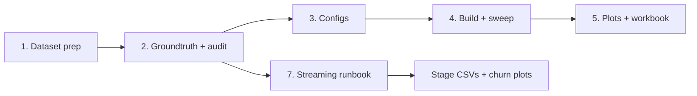

# Graph-IVF Benchmark Experiments

End-to-end procedure for graph-IVF comparisons and streaming runbook experiments. Read the
applicable stage reference before doing that stage.

## Where things live

| What | Where | Tracked? |
|---|---|---|
| Corpora, queries, groundtruth, saved indexes | `<data-root>/<dataset>/` | No — outside the repo |
| Dataset prep tool (`vecprep.py`, `compress_minmax`) | `diskann-graphivf/scripts/dataprep/` | Yes |
| Portable example configs | `diskann-benchmark/example/graph-ivf-*.json` | Yes |
| Local sweep / churn / runbook configs | `_results/configs/` | **No — untracked** |
| Runner binary | `target/release/diskann-benchmark.exe` | No (build output) |
| Run logs + results | `_results/logs/<dataset>/*.{json,log}` | **No — untracked** |
| Analysis scripts + dataset registry | `_results/scripts/`, `_results/scripts/registry.py` | **No — untracked** |
| Figures / workbooks | `_results/plots/<dataset>/`, `_results/workbooks/` | **No — untracked** |

`<data-root>` is a directory of your choosing outside the clone — the datasets are far too
large to live in the repository, and nothing in the tooling assumes a particular location.
The study used a `data/` directory sitting alongside the clone. Wherever you put it, the
path appears only in benchmark configs and on `vecprep.py` command lines.

`_results/` is not gitignored, it has simply never been committed. Treat it as local
working state and do not assume a teammate has it. Superseded one-off scripts are parked in
`_results/scripts/_archive/` rather than deleted, for the same reason — there is no git
history to recover them from.

**The tooling is dataset-agnostic and must stay that way.** `vecprep.py` handles any corpus
via flags, and every plot/workbook script reads `registry.py` instead of naming datasets.
Adding a dataset-specific script is a regression, not a shortcut.

## Pipeline



1. **[Dataset preparation](./references/01-dataset-prep.md)** — acquire vectors, convert to
  the full-precision / benchmark storage formats, subsample queries.
2. **[Groundtruth](./references/02-groundtruth.md)** — compute exact top-1000 **and audit it**.
   Skipping the audit is the single most expensive mistake available here.
3. **[Benchmark configs](./references/03-configs.md)** — choose among `Static`, `Online`,
   `Load`, and `OnlineRunbook`; combine recall depths where practical.
4. **[Running](./references/04-running.md)** — build the runner, execute builds and sweeps,
   capture logs.
5. **[Analysis](./references/05-analysis.md)** — add the dataset to `registry.py`, render the
   four standard figures, refresh the workbook.
7. **[Streaming runbooks](./references/07-online-runbooks.md)** — audit a BigANN plan,
  subset queries and every truthset consistently, run live insert/delete/search stages,
  and export stage/split/merge trajectories.

[Environment and tooling gotchas](./references/06-environment.md) apply throughout; read it
first if anything behaves strangely.

## Invariants

Violating any of these produces results that look plausible and are wrong, or costs hours.

**Measurement**

- **Audit the groundtruth before trusting any recall number.** Degenerate rows (all-zero
  vectors from empty documents) land *inside* the retrieval band under squared L2 and
  silently cap recall. See [stage 2](./references/02-groundtruth.md).
- **Search configs sweep `cluster_fractions`, not concrete `nlist`.** Values must be in
  `(0.0, 1.0]`; the runner computes `ceil(fraction * num_clusters)` for each index or
  runbook stage and reports that effective `nlist` alongside the fraction.
- **Prefer a list for `recall_at`.** A scalar remains supported for legacy configs, but
  `[50, 1000]` scores both depths from one search per cluster fraction. Values are sorted
  and deduplicated during validation.
- **Sweep single-threaded** (`num_threads: 1`) so latency and per-query I/O are comparable.

**Process**

- **Build once, save, then sweep from `Load` configs.** Never rebuild an immutable index to
  re-sweep it. `OnlineRunbook` is the exception: searches intentionally observe the live
  partition between mutations, so build and search stages are one replay.
- **Encode every experimental variable in the index and log name.** `_nozero_`, `_s32_`,
  `_b4096_`, `_iters6_`, `_t800_`. Analysis selects runs by these paths, and a superseded
  run left on disk with an ambiguous name will be silently picked up.
- **Run one benchmark command at a time.** A PowerShell `foreach` over several runs
  silently no-ops. See [environment](./references/06-environment.md).
- **Never clean up a terminal with a run in flight** — it kills the child process and you
  lose the sweep with no log and no error.

## Quick reference

```powershell
# Build the runner (from repo root)
cargo build --release -p diskann-benchmark --features graph-ivf

# One run: config in, JSON out, console tee'd to a log
$b = "<absolute-repo-root>"
& "$b\target\release\diskann-benchmark.exe" run `
    --input-file  "$b\_results\configs\<group>\<config>.json" `
    --output-file "$b\_results\logs\<dataset>\<run>.json" `
    2>&1 | Tee-Object -FilePath "$b\_results\logs\<dataset>\<run>.log" | Out-Null
Write-Output "DONE exit=$LASTEXITCODE"

# Regenerate all figures and the workbook (use the configured Python environment)
Push-Location "$b\_results\scripts"
python plot_online_bytes_recall.py
python plot_online_diskread_recall.py
python plot_online_latency_breakdown.py
python plot_online_cost.py
python build_online_workbook.py
Pop-Location
```
