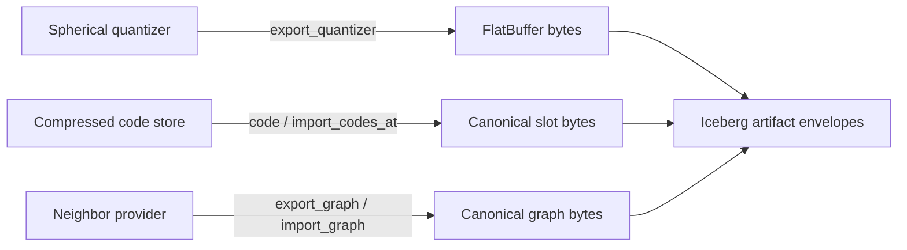

# Iceberg Vamana Prototype: DiskANN Implementation Summary

## Scope

This document summarizes the DiskANN changes after commit
`74c060bb0a55a5578c780a435f3ed0ee37a0aeab` through `c1d84f41` (`HEAD` when
this summary was written). The range contains three commits, changes five files,
and adds approximately 601 lines while removing two.

These changes are deliberately narrow. They expose the in-memory serialization
and import primitives needed by the Iceberg integration without adding Iceberg,
Arrow, Parquet, Puffin, catalog, or object-store dependencies to DiskANN. The
Iceberg repository owns artifact envelopes, checksums, row identities, snapshot
maintenance, publication, and query reranking.

The broader design remains in
[ICEBERG_VAMANA_PROTOTYPE.md](ICEBERG_VAMANA_PROTOTYPE.md). Some items in that
document describe the target state contract rather than code completed in this
three-commit range; the distinction is called out below.

## Repository Boundary

The prototype uses the existing asynchronous in-memory provider stack:

```text
DiskANNIndex<
  DefaultProvider<NoStore, SphericalStore, TableDeleteProviderAsync>
>
```

DiskANN continues to use dense `u32` node IDs. The mapping from a node ID to an
Iceberg physical row identity `(_file, _pos)` is not introduced here. The
Iceberg adapter serializes that mapping as a separate blob and wraps the bytes
exported by these APIs in its own versioned Puffin artifact format.

The implemented boundary is byte-oriented:



## Changed Files

### `diskann-providers/Cargo.toml`

[diskann-providers/Cargo.toml](diskann-providers/Cargo.toml) enables the
`flatbuffers` feature on `diskann-quantization`. This makes the existing
spherical quantizer plan serialization API available to the provider crate.
No new third-party integration or storage dependency was added.

### Spherical Quantizer And Code Persistence

[spherical.rs](diskann-providers/src/model/graph/provider/async_/inmem/spherical.rs)
adds the following public API:

- `SphericalStore::export_quantizer`
- `SphericalStore::code`
- `SphericalStore::import_codes`
- `SphericalStore::import_codes_at`
- `CodeImportError`

#### Quantizer export

`export_quantizer` delegates to the existing spherical plan serializer and
returns its canonical FlatBuffer bytes. It does not define a second quantizer
encoding. The caller is responsible for adding an artifact version, expected
metric and dimension metadata, a fingerprint, and a checksum.

Quantizer deserialization remains in `diskann-quantization`; the Iceberg
adapter dispatches through that existing interface when recreating a store.

#### Canonical compressed-code access

`code(index)` exposes the raw bytes for one aligned code slot. It provides the
container-neutral representation needed to stream code slots into an external
artifact without serializing allocator padding or copying the entire store into
another DiskANN-specific file format.

The method is a slot view, not a complete code artifact. It does not carry
populated count, total capacity, node allocation state, bit width, metric, or
other compatibility metadata.

#### Code import

`import_codes` imports at slot zero. `import_codes_at` supports restoring or
updating consecutive slots beginning at a caller-selected slot.

The import path:

1. Requires payload length to be an exact multiple of bytes per code.
2. Computes the number of represented slots.
3. Checks arithmetic overflow for `start + count`.
4. Rejects writes beyond the preallocated store capacity.
5. Copies each code-sized chunk into the corresponding aligned slot.

`CodeImportError` distinguishes a misaligned payload from capacity exhaustion.
Compatibility beyond code width and capacity remains the caller's
responsibility. In particular, this API does not independently validate metric,
input dimension, transformed dimension, quantizer fingerprint, bit width, byte
order, format version, or checksum.

### In-Memory Graph Export And Import

[provider.rs](diskann-providers/src/model/graph/provider/async_/inmem/provider.rs)
adds:

- `DefaultProvider::export_graph`
- `DefaultProvider::import_graph`
- a private in-memory storage adapter implementing the existing storage read
  and write traits.

`export_graph` routes the in-memory neighbor provider through the existing
canonical graph writer and returns the resulting bytes. It accepts the start
point that is written into the graph header.

`import_graph` reads canonical graph bytes into an already constructed,
preallocated provider. It compares the start point decoded from the graph with
the expected start point supplied by the caller. A mismatch fails the import.

The in-memory storage adapter is only a bridge to the existing save/load
machinery. It does not establish a separate graph format.

### Checked Neighbor Graph Import

[simple_neighbor_provider.rs](diskann-providers/src/model/graph/provider/async_/simple_neighbor_provider.rs)
adds `SimpleNeighborProviderAsync::import_direct`.

The method imports a canonical graph into existing adjacency storage and
validates structural compatibility before accepting it:

- total points in the graph must equal provider capacity;
- serialized maximum degree must fit the provider's allocated adjacency width;
- the number of start points must equal the provider configuration; and
- every imported neighbor ID must be inside the allocated node range.

It returns the start point encoded in the graph so the provider-level wrapper
can compare it with the runtime state expected by the caller.

This import restores adjacency only. It does not restore deletion state,
current populated count, next available node ID, frozen-point values, index
configuration, pruning parameters, or other mutable runtime state.

### Prototype Design Document

[ICEBERG_VAMANA_PROTOTYPE.md](ICEBERG_VAMANA_PROTOTYPE.md) was added and then
updated as the cross-repository design settled. In particular, overlays were
changed from a possible secondary graph into an Iceberg-owned flat structure:

- a base remains a quantized Vamana index;
- overlay deletes are Iceberg row identities;
- overlay inserts retain full-precision vectors;
- overlay inserts are exact flat-scanned; and
- only consolidation compresses inserts and applies them to the base graph.

The document also records the intended long-term container-neutral state
contract and the responsibilities that remain outside DiskANN.

## Implemented State Surface

The completed APIs provide these primitives:

| State component | Export | Import | Validation in DiskANN |
| --- | --- | --- | --- |
| Spherical quantizer | Canonical FlatBuffer plan bytes | Existing quantization deserializer | Existing plan decoder; no new outer envelope |
| Compressed codes | Per-slot canonical byte view | Consecutive slot copy | Code-size alignment, overflow, and capacity |
| Vamana adjacency | Canonical graph bytes | Import into preallocated provider | Capacity, degree, start-point count/value, neighbor ID range |

These are sufficient for the current Iceberg adapter because it owns the
missing context and reconstructs a provider with known configuration before
importing bytes.

## Items Intentionally Owned By `iceberg-rust`

The sibling integration crate, not this repository, supplies:

- versioned and checksummed Puffin envelopes;
- expected metric, dimensions, bit width, transform, and quantizer fingerprint;
- base populated count, capacity, and frozen-node layout;
- resolved build and search parameters;
- deletion and node-allocation state used when reconstructing a mutable base;
- dense node ID to `(_file, _pos)` mapping;
- exact table-snapshot discovery and catalog compare-and-swap publication;
- cumulative overlay encoding and flat search;
- Parquet point reads and asynchronous exact reranking; and
- fallback rebuild behavior when persisted state or capacity is incompatible.

Keeping these concerns out of DiskANN preserves a reusable provider API and
avoids coupling graph internals to one table format or artifact container.

## Commit History

| Commit | Main change |
| --- | --- |
| `84067af7` | Added the DiskANN-side Iceberg Vamana prototype plan |
| `f2f987fb` | Enabled quantizer serialization, added quantizer/code views, and graph export |
| `c1d84f41` | Added checked code and graph import paths for Puffin reload |

## Validation Added Or Exercised

The changed spherical provider tests include
`exports_quantizer_and_canonical_codes`, which verifies that exported quantizer
bytes deserialize and that canonical code slots have the expected shape and
content.

The neighbor provider already had save/load round-trip coverage that exercises
the canonical graph storage format reused by the new in-memory bridge. The
Iceberg repository's integration and end-to-end tests additionally exercise
the new APIs through base artifact export, fresh-process import, search,
overlay consolidation, and a second import.

There are no focused DiskANN tests in this commit range for:

- `import_codes` and `import_codes_at` success and failure cases;
- `DefaultProvider::import_graph` start-point rejection;
- each structural rejection in `import_direct`;
- partial-capacity code round trips;
- import followed by insert, delete, consolidate, export, and re-import; or
- the complete 1-, 2-, and 4-bit `DoubleHadamard` matrix proposed in the plan.

This section describes test coverage present in the range; it does not claim
that the test suite was rerun while preparing this summary.

## Difference Between The Plan And The Realized Changes

The design document proposes one complete versioned graph/runtime state
contract. This commit range implements lower-level persistence primitives
instead. It does **not** add:

- `SphericalQuantizerState` or an equivalent versioned public envelope;
- a bulk compressed-code envelope with count, alignment, byte order, version,
  and checksum;
- `SaveWith`/`LoadWith` parity for `SphericalStore`;
- a graph/runtime envelope containing deletion and allocation state;
- one high-level helper that recreates a fully configured, mutable index from
  all components; or
- the full mismatch and corruption test matrix listed in the plan.

Those omissions do not block the current prototype because the Iceberg adapter
adds its own envelopes and reconstructs runtime context before calling these
imports. They do mean the new DiskANN APIs alone are not yet a self-describing,
long-term persistence format.

## Current Limitations And Risks

- Graph import mutates preallocated adjacency storage. A caller must validate
  all outer metadata before beginning a multi-component import if it requires
  transactional all-or-nothing restoration.
- Code import validates byte shape and capacity but cannot detect bytes encoded
  by a different quantizer with the same code width.
- Graph bytes have structural checks but no checksum at this layer; external
  containers must provide corruption detection.
- Adjacency import alone is insufficient to reproduce lazy deletion and future
  node allocation behavior.
- The binary compatibility promise belongs to the prototype's outer artifact
  version, not to these raw byte APIs across arbitrary DiskANN releases.
- Build and graph search remain fully resident in memory, as intended by the
  prototype.