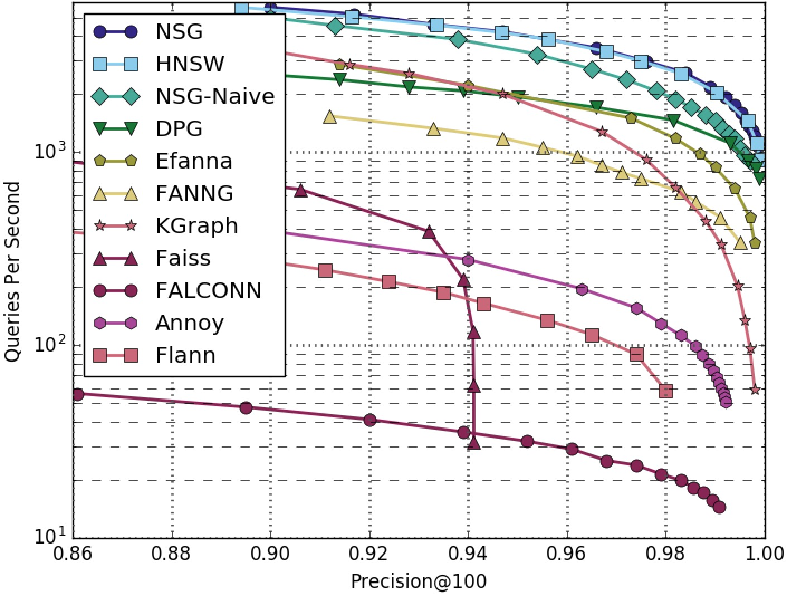
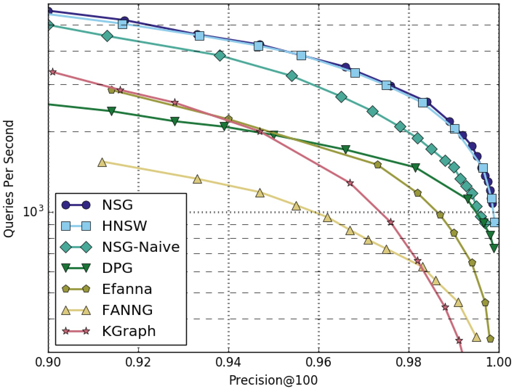
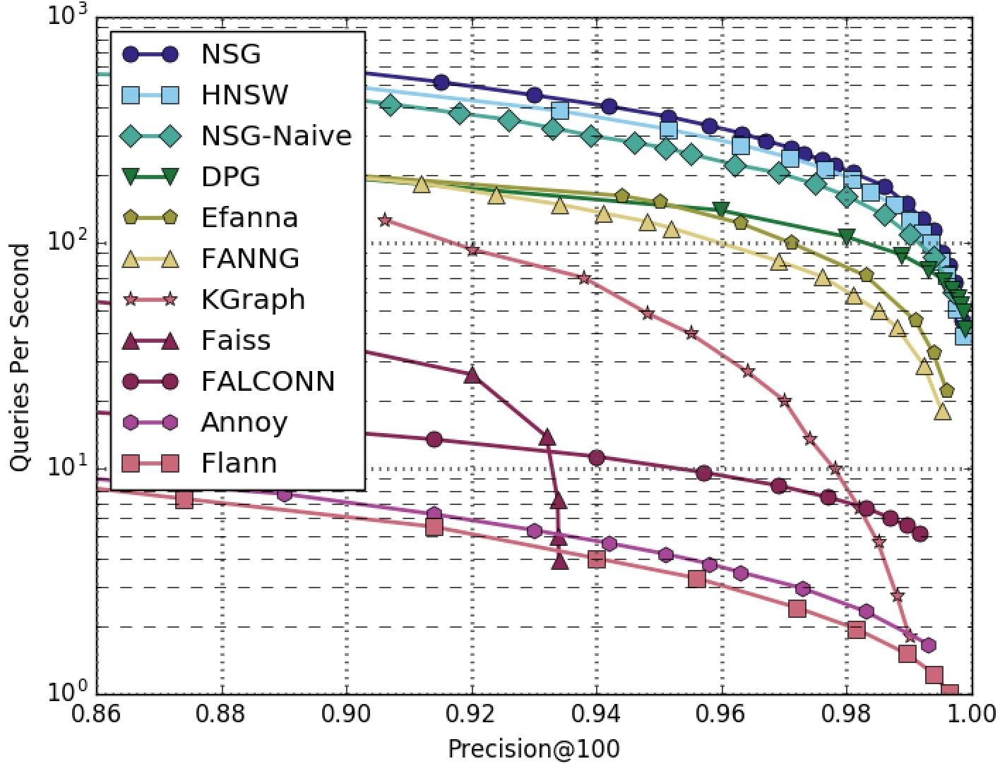
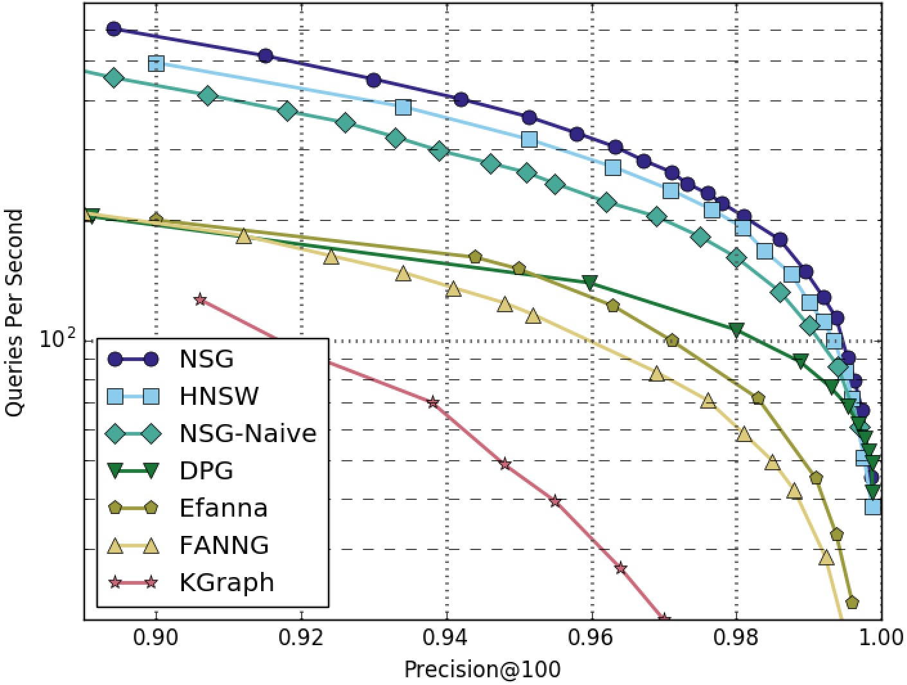
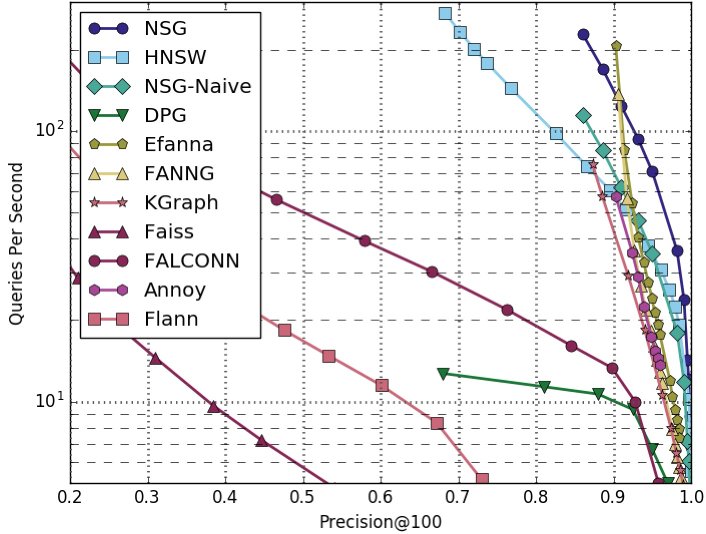
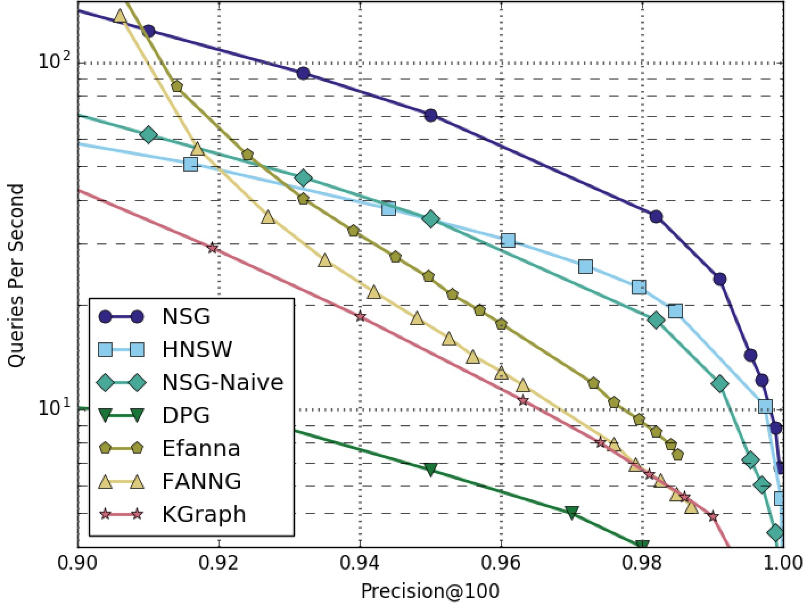
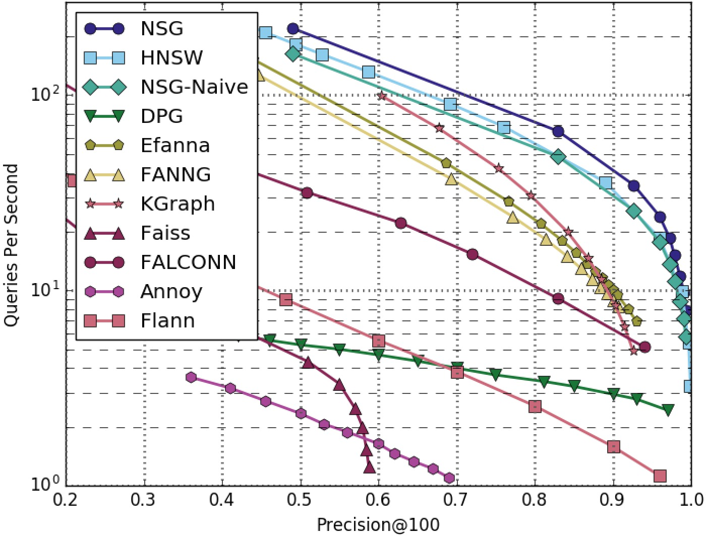
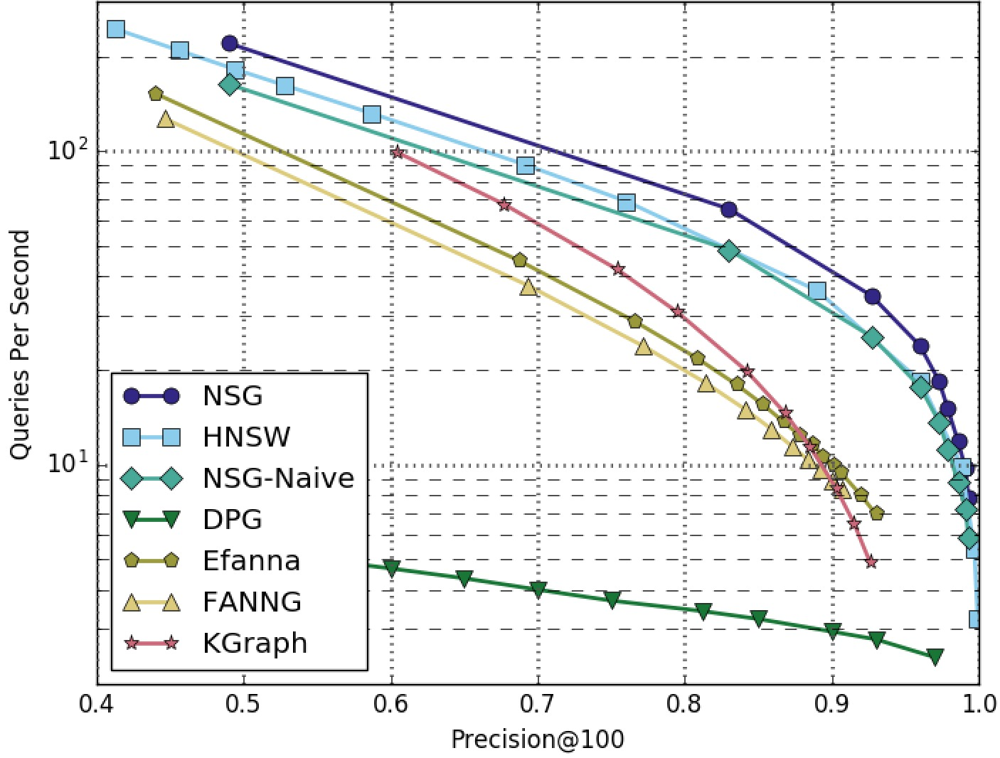
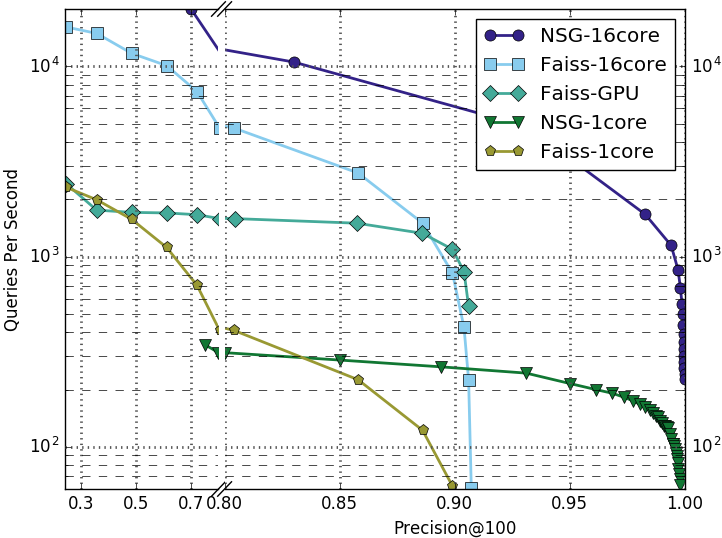

# NSG : Navigating Spread-out Graph For Approximate Nearest Neighbor Search

## Introduction

NSG is a graph-based approximate nearest neighbor search (ANNS) algorithm. It provides a flexible and efficient solution for the metric-free large-scale ANNS on dense real vectors. It implements the algorithm of our paper, [Fast Approximate Nearest Neighbor Search With Navigating Spread-out Graphs.](https://arxiv.org/abs/1707.00143)
NSG has been intergrated into the search engine of Taobao (Alibaba Group) for billion scale ANNS in E-commerce scenario.

## Performance

### Datasets

+ [SIFT1M and GIST1M](http://corpus-texmex.irisa.fr/)
+ Synthetic datasets: RAND4M and GAUSS5M
	- RAND4M: 4 million 128-dimension vectors sampled from a uniform distribution of [-1, 1].
	- GAUSS5M: 5 million 128-dimension vectors sampled from a gaussion ditribution N(0,3).

### Compared Algorithms

#### Graph-based ANNS algorithms:

+ [kGraph](http://www.kgraph.org)
+ [FANNG](https://pdfs.semanticscholar.org/9ea6/5687a21c869fce7ecf17ca25ffcadbf77d69.pdf) : *FANNG: Fast Approximate Nearest Neighbour Graphs*
+ [HNSW](https://arxiv.org/abs/1603.09320) ([code](https://github.com/searchivarius/nmslib)) : *Efficient and robust approximate nearest neighbor search using Hierarchical Navigable Small World graphs*
+ [DPG](https://arxiv.org/abs/1610.02455) ([code](https://github.com/DBWangGroupUNSW/nns_benchmark)) : *Approximate Nearest Neighbor Search on High Dimensional Data --- Experiments, Analyses, and Improvement (v1.0)*
+ [EFANNA](https://arxiv.org/abs/1609.07228) ([code](https://github.com/fc731097343/efanna)) : *EFANNA: An Extremely Fast Approximate Nearest Neighbor Search Algorithm Based on kNN Graph*
+ NSG-naive: a designed based-line, please refer to [our paper](https://arxiv.org/abs/1707.00143).
+ NSG: This project, please refer to [our paper](https://arxiv.org/abs/1707.00143).

#### Other popular ANNS algorithms:

+ [FLANN](http://www.cs.ubc.ca/research/flann/)
+ [FALCONN](https://github.com/FALCONN-LIB/FALCONN)
+ [Annoy](https://github.com/spotify/annoy)
+ [Faiss](https://github.com/facebookresearch/faiss)

### Results

NSG achieved the **best** search performance among all the compared algorithms on all the four datasets.
Among all the ***graph-based algorithms***, NSG has ***the smallest index size*** and ***the best search performance***.

***NOTE:** The performance was tested without parallelism (search one query at a time and no multi-threads)*

**SIFT1M-100NN-All-Algorithms**



**SIFT1M-100NN-Graphs-Only**



**GIST1M-100NN-All-Algorithms**



**GIST1M-100NN-Graphs-Only**



**RAND4M-100NN-All-Algorithms**



**RAND4M-100NN-Graphs-Only**



**GAUSS5M-100NN-All-Algorithms**



**GAUSS5M-100NN-Graphs-Only**



**DEEP1B-100NN**



## Building Instruction

### Prerequisites

+ GCC 4.9+ with OpenMP
+ CMake 2.8+
+ Boost 1.55+
+ [TCMalloc](http://goog-perftools.sourceforge.net/doc/tcmalloc.html)

### Compile On Ubuntu/Debian

1. Install Dependencies:

```shell
$ sudo apt-get install g++ cmake libboost-dev libgoogle-perftools-dev
```

2. Compile NSG:

```shell
$ git clone https://github.com/ZJULearning/nsg.git
$ cd nsg/
$ mkdir build/ && cd build/
$ cmake -DCMAKE_BUILD_TYPE=Release ..
$ make -j
```

## Usage

The main interfaces and classes have its respective test codes under directory `tests/`

### Building NSG Index

To use NSG for ANNS, an NSG index must be built first. Here are the instructions for building NSG.

#### Step 1. Build kNN Graph

Firstly, we need to prepare an kNN graph.

We suggest you use our [efanna\_graph](https://github.com/ZJULearning/efanna\_graph) to build this kNN graph. But you can also use any alternatives you like, such as KGraph or faiss.

#### Step 2. Convert kNN Graph to NSG

Secondly, we will convert the kNN graph to our NSG index.

You can use our demo code to achieve this converstion as follows:
```shell
$ cd build/tests/
$ ./test_nsg_index DATA_PATH KNNG_PATH L R C NSG_PATH
```

+ `DATA_PATH` is the path of the base data in `fvecs` format.
+ `KNNG_PATH` is the path of the pre-built kNN graph in *Step 1.*.
+ `L` controls the quality of the NSG, the larger the better.
+ `R` controls the index size of the graph, the best R is related to the intrinsic dimension of the dataset.
+ `C` controls the maximum candidate pool size during NSG contruction.
+ `NSG_PATH` is the path of the generated NSG index.

### Searching via NSG Index

Here are the instructions of how to use NSG index for searching.

You can use our demo code to perform kNN searching as follows:
```shell
$ cd build/tests/
$ ./test_nsg_optimized_search DATA_PATH QUERY_PATH NSG_PATH SEARCH_L SEARCH_K RESULT_PATH
```

+ `DATA_PATH` is the path of the base data in `fvecs` format.
+ `QUERY_PATH` is the path of the query data in `fvecs` format.
+ `NSG_PATH` is the path of the pre-built NSG index in previous section.
+ `SEARCH_L` controls the quality of the search results, the larger the better but slower. The `SEARCH_L` cannot be samller than the `SEARCH_K`
+ `SEARCH_K` controls the number of result neighbors we want to query.
+ `RESULT_PATH` is the query results in `ivecs` format.

There is another program in `tests/` folder named `test_nsg_search`. The parameters of `test_nsg_search` are exactly same as `test_nsg_optimized_search`. `test_nsg_search` is slower than `test_nsg_optimized_search` but requires less memory. In the situations memory consumption is extremely important, one can use `test_nsg_search` instead of `test_nsg_optimized_search`.

***NOTE:** Only data-type int32 and float32 are supported for now.*

> HINT: The `data_align()` function we provided is essential for the correctness of our procedure, because we use SIMD instructions for acceleration of numerical computing such as AVX and SSE2.
You should use it to ensure your data elements (feature) is aligned with 8 or 16 int or float.
For example, if your features are of dimension 70, then it should be extend to dimension 72. And the last 2 dimension should be filled with 0 to ensure the correctness of the distance computing. And this is what `data_align()` does.

> HINT: Please refer [here](http://yael.gforge.inria.fr/file_format.html) for the desciption of `fvecs/ivecs` format.

## Parameters used in Our Paper

### NSG Building

We use the following parameters to get the index in Fig. 6 of [our paper](https://arxiv.org/abs/1707.00143).
(We use [efanna_graph](https://github.com/ZJULearning/efanna_graph) to build the kNN graph)

#### Step 1. Build kNN Graph

+ Tool: [efanna_graph](https://github.com/ZJULearning/efanna_graph)
+ Parameters:

| Dataset |  K  |  L  | iter |  S |  R  |
|:-------:|:---:|:---:|:----:|:--:|:---:|
|  SIFT1M | 200 | 200 |  10  | 10 | 100 |
|  GIST1M | 400 | 400 |  12  | 15 | 100 |

+ Commands:
```shell
$ efanna_graph/tests/test_nndescent sift.fvecs sift_200nn.graph 200 200 10 10 100	# SIFT1M
$ efanna_graph/tests/test_nndescent gist.fvecs gist_400nn.graph 400 400 12 15 100	# GIST1M
```

#### Step 2. Convert kNN Graph to NSG

+ Parameters:

| Dataset |  L |  R |  C  |
|:-------:|:--:|:--:|:---:|
|  SIFT1M | 40 | 50 | 500 |
|  GIST1M | 60 | 70 | 500 |

+ Commands:
```shell
$ nsg/build/tests/test_nsg_index sift.fvecs sift_200nn.graph 40 50 500 sift.nsg		# SIFT1M
$ nsg/build/tests/test_nsg_index gist.fvecs gist_400nn.graph 60 70 500 gist.nsg		# GIST1M
```

### Pre-built kNN Graph and NSG Index

Here we also provide our pre-built kNN graph and NSG index files used in our papar's experiments.

Those files are generated using the parameters and commands above.

- kNN Graph:
	+ SIFT1M - [sift_200nn.graph](http://downloads.zjulearning.org:8081/sift_200nn.graph)
	+ GIST1M - [gist_400nn.graph](http://downloads.zjulearning.org:8081/gist_400nn.graph)
- NSG Index:
	+ SIFT1M - [sift.nsg](http://downloads.zjulearning.org:8081/sift.nsg)
	+ GIST1M - [gist.nsg](http://downloads.zjulearning.org:8081/gist.nsg)

## Performance on Taobao's E-commerce Data

**Environments:**
+ **CPU**: Xeon E5-2630.

**Single Thread Test:**
+ **Dataset**: 10,000,000 128-dimension vectors.
+ **Latency**: 1ms (average) on 10,000 query.

**Distributed Search Test:**
+ **Dataset**: 45,000,000 128-dimension vectors.
Distribute:  randomly divide the dataset into 12 subsets and build 12 NSGs. Search in parallel and merge results.
+ **Latency**: 1ms (average) on 10,000 query.

## Reference

Reference to cite when you use NSG in a research paper:
```
@article{DBLP:journals/corr/FuWC17,
  author    = {Cong Fu and Chao Xiang and Changxu Wang and Deng Cai},
  title     = {Fast Approximate Nearest Neighbor Search With Navigating Spreading-out Graphs},
  journal   = {CoRR},
  volume    = {abs/1707.00143},
  url       = {http://arxiv.org/abs/1707.00143},
}
```

## License

NSG is MIT-licensed.
