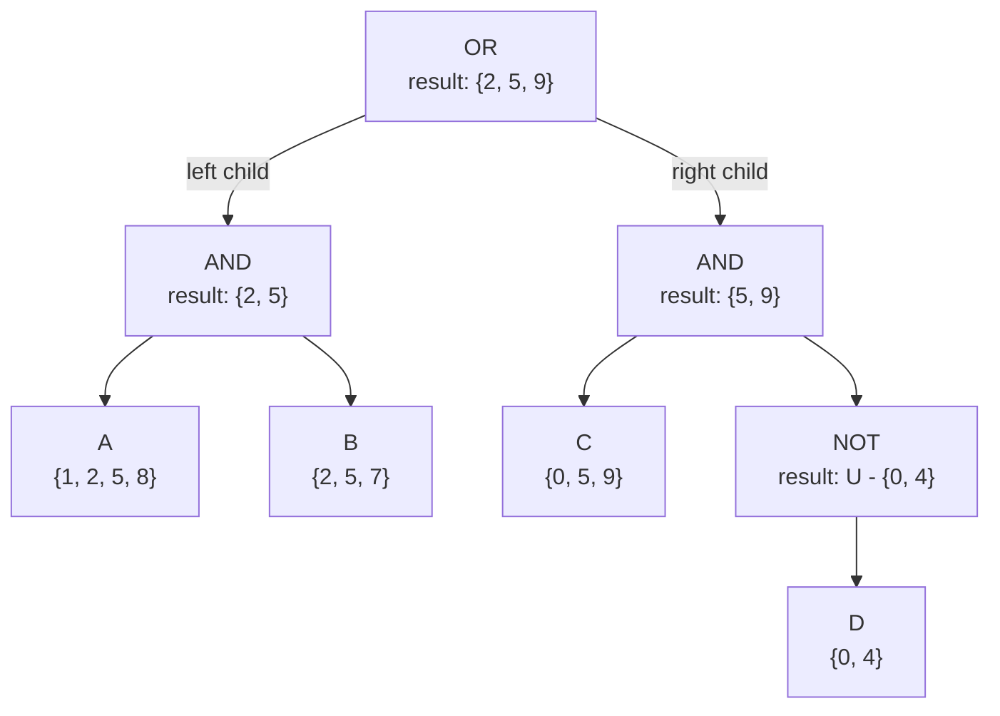
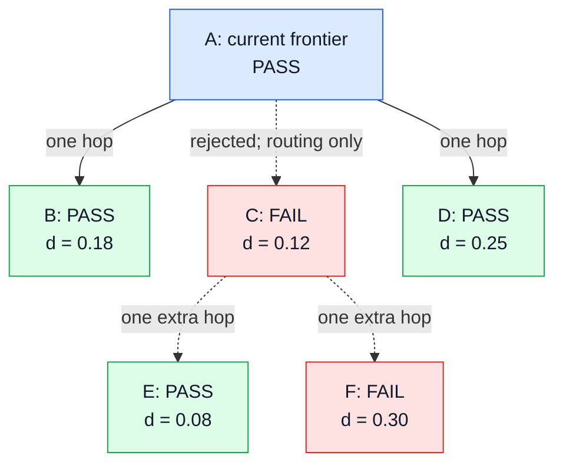

# Multi-Filter ANN Optimization Summary

## Executive summary

The objective was to keep the high recall of Rust multihop filtered search while reducing the
query-time cost of evaluating multi-label filters.

The original Rust benchmark used an **Abstract Syntax Tree (AST)** to precompute the complete
matching-document bitmap before ANN traversal. This made each traversal-time membership check
cheap, but the reported **3.15-6.84 ms** mean latency at `L=150` excluded the expensive per-query
bitmap construction.

The final implementation keeps the same multihop traversal and replaces query-result
materialization with:

1. a persisted, attribute-major **Bitslice** label index; and
2. a flat **Disjunctive Normal Form (DNF)** query plan evaluated directly against the Bitslice data;
   and
3. a concrete query-provider type retained through the filtered-search hot path for static
   dispatch.

In the query-inclusive comparison, Bitmap+AST required **6.15-46.48 ms**, while Bitslice+DNF
required **2.70-6.82 ms**. Bitslice+DNF was **3.13x faster by geometric-mean average latency**.
Recall, distance comparisons, and graph hops were identical, so this was a filter-evaluation
improvement rather than a quality trade-off.

## Test scope

| Item | Configuration |
|---|---|
| Dataset | 9,996,160 PMax vectors |
| Vector type | 64-dimensional float32 benchmark data |
| Label vocabulary | 596 labels |
| Queries | 1,000 |
| Filter workload | 9 single-label and multi-label predicates |
| Selectivity | 1.17% to 66.40% |
| Search | `k=150`, `L=150`, one thread, three repetitions |
| Correctness | Exact filtered ground truth; identical recall/comparisons/hops across compared providers |

## Original Rust implementation: precomputed Bitmap + AST

The original implementation separated filter evaluation from graph traversal. Before search, it
parsed the query into a recursive Boolean predicate, combined the label posting lists, and
materialized the complete set of matching vector IDs. The ANN multihop traversal then checked each
visited vector against that prebuilt bitmap. Once the complete match set was available, each
membership check was cheap.

### Precomputed Roaring label map

The persistent index is an inverted map from labels to vector IDs. It is built once with the ANN
index rather than rebuilt for every query:

| Component | Structure | Purpose |
|---|---|---|
| Label dictionary | Ordered label strings | Gives every distinct label a stable numeric ID |
| Label lookup | Label string to numeric ID | Resolves each terminal in the query expression |
| Posting table | One Roaring bitmap at each label-ID position | Stores every vector ID carrying that label |
| Vector count | Total number of addressable vector IDs | Defines the universe used by `NOT` and the final dense bitmap |

#### Worked Roaring map example

Assume ten vectors have the following labels:

| Vector ID | Assigned labels |
|---:|---|
| 0 | C, D |
| 1 | A |
| 2 | A, B |
| 3 | None |
| 4 | D |
| 5 | A, B, C |
| 6 | None |
| 7 | B |
| 8 | A |
| 9 | C |

The encoder inverts those vector rows into a dictionary and a posting array:

```text
labels      = ["A", "B", "C", "D"]
label_ids   = {"A": 0, "B": 1, "C": 2, "D": 3}

postings[0] = Roaring{1, 2, 5, 8}  // vectors carrying A
postings[1] = Roaring{2, 5, 7}     // vectors carrying B
postings[2] = Roaring{0, 5, 9}     // vectors carrying C
postings[3] = Roaring{0, 4}        // vectors carrying D

num_vectors = 10
```

The two arrays are aligned by numeric label ID. A query terminal `C` therefore performs
`label_ids["C"] -> 2 -> postings[2]`; the posting itself stores only vector IDs, not another copy of
the string `C`. For `A AND C`, the evaluator intersects `postings[0]` and `postings[2]` and obtains
`{5}`. The same postings are reused in the AST example below.

Each posting is a compressed, ordered set of 32-bit vector IDs. Roaring partitions the ID space by
the upper 16 bits, creating one container for each populated 65,536-ID range. All IDs in the small
example are in range 0, so the A posting is one sparse container:

```text
postings[0] for A
  container key 0 -> offsets [1, 2, 5, 8]
```

If A also appeared on vector 65,538, Roaring would place offset 2 in a second container because
`65,538 = 1 * 65,536 + 2`:

```text
postings[0] for A
  container key 0 -> offsets [1, 2, 5, 8]
  container key 1 -> offsets [2]
```

Sparse ranges retain compact sorted offsets, while dense ranges use bitmaps. Union, intersection,
and subtraction operate on matching containers rather than scanning all 9,996,160 vectors. This is
why the persisted Roaring index is only **59.0 MiB** for PMax, far smaller than one dense
vector-length bit slice for every label. The posting table is immutable after loading and is shared
across queries.

On disk, the index contains a small format header, the label dictionary, and one length-prefixed
serialized Roaring posting per label. At load time, the dictionary is reconstructed into the
label-to-ID lookup and the postings become a numeric-ID-indexed array. Therefore a query terminal
requires one label lookup followed by direct access to its posting bitmap.

### How the AST produces a query bitmap

The query is parsed into a tree whose leaves are labels and whose internal nodes are Boolean
operators. Label strings are first replaced with their numeric IDs; a label absent from the index
represents an empty posting.

The evaluator uses a depth-first, post-order traversal. It enters at the root, recursively descends
to a leaf, returns that leaf's posting bitmap to its parent, and combines child results while
unwinding back up the tree. An operator is therefore entered before its children but produces its
result only after the required children have returned. The root is the last node to produce a
bitmap, and that bitmap is the final query result.

| AST node | Bitmap evaluation |
|---|---|
| Label | Copy that label's precomputed Roaring posting |
| `AND` | Intersect the child results; stop as soon as the intermediate result is empty |
| `OR` | Union the child results into an initially empty bitmap |
| `NOT` | Start with the full vector-ID universe and subtract the child result |

For a small example, assume A maps to `{1, 2, 5, 8}`, B to `{2, 5, 7}`, C to `{0, 5, 9}`, and D
to `{0, 4}`. The expression `(A AND B) OR (C AND NOT D)` produces this AST:



`U` is the full valid vector-ID universe. The evaluator walks the tree as follows:

1. Enter the root `OR`, then descend into its left `AND` subtree.
2. Visit leaf A and return `{1, 2, 5, 8}`; visit leaf B and return `{2, 5, 7}`.
3. The left `AND` intersects those child results and returns `{2, 5}` to the root.
4. Descend into the right `AND`. Leaf C returns `{0, 5, 9}`. The `NOT` node descends to D,
   receives `{0, 4}`, subtracts it from `U`, and returns `U - {0, 4}`.
5. The right `AND` intersects `{0, 5, 9}` with `U - {0, 4}` and returns `{5, 9}`.
6. After both subtrees have returned, the root `OR` unions `{2, 5}` with `{5, 9}` and produces
   the final match set `{2, 5, 9}`.

Each internal node can create or modify an intermediate Roaring bitmap. After the root is evaluated,
the final Roaring result is converted into a dense array of 64-bit words with one bit per vector.
For 9,996,160 PMax vectors, this final query bitmap is about **1.19 MiB**. Multihop search then tests
a candidate by loading one word and checking the candidate's bit; it no longer walks the AST during
graph traversal.

This design deliberately moves work out of the traversal hot path. Its cost is paid once for each
new predicate: resolve the AST terminals, clone and combine Roaring postings, allocate and zero the
dense result, and enumerate every matching ID to set its bit. Broad predicates create large
intermediate and final sets, which explains why query-inclusive Bitmap+AST latency grows sharply
even though its later per-node membership checks are inexpensive.

This approach has two different performance views:

| Measurement | Mean latency | Meaning |
|---|---:|---|
| Original search-only benchmark | 3.15-6.84 ms | Bitmap already existed; AST evaluation and materialization were outside search timing |
| Query-inclusive Bitmap+AST | 6.15-46.48 ms | Includes AST compilation, Roaring set operations, dense allocation/zeroing, and materialization |

The search-only result is useful as a warm-cache ideal, but it is not the end-to-end latency of a
new filter predicate. Broad predicates are especially expensive because millions of matching IDs
must be enumerated and copied into the query bitmap.

## How multihop traverses the graph compared with normal ANN

Normal ANN performs a greedy beam search. It repeatedly expands the closest unvisited node and adds
its promising neighbors to a bounded search list. Labels do not affect this traversal, so every
discovered node is eligible to remain in the list, be expanded later, and become a result.

Multihop makes two important changes for newly discovered neighbors:

1. **Only nodes that pass the filter enter the search list.** A failed node cannot consume a search
   list slot, be selected as a normal frontier node, or become a result.
2. **A selected failed one-hop neighbor can still expose its children.** Multihop inspects that
   failed node's adjacency list once. Passing grandchildren enter the search list; failed
   grandchildren are discarded, so the routing path does not continue through them.

The following local graph is shown as a traversal tree. `PASS` and `FAIL` describe the filter
result, and `d` is distance to the query. Assume beam width 1 and a search list large enough to hold
all nodes in the example.



The table shows only the **unexpanded frontier** of the search list, ordered by query distance.
Normal ANN ignores the displayed filter status; it is included only to make the comparison visible.

| Stage | Normal ANN search-list frontier | Multihop search-list frontier |
|---|---|---|
| Seed | `[A]` | `[A]` |
| Expand `A` | `[C FAIL 0.12, B PASS 0.18, D PASS 0.25]` | `[B PASS 0.18, D PASS 0.25]`; `C` is kept only as a temporary routing choice |
| Handle `C` | `C` is the closest candidate, so normal ANN expands it and gets `[E PASS 0.08, B PASS 0.18, D PASS 0.25, F FAIL 0.30]` | Without inserting `C`, multihop inspects its children once: `E` passes and enters the list, while `F` fails and is dropped, producing `[E PASS 0.08, B PASS 0.18, D PASS 0.25]` |
| Select the next frontier | Expand `E` | Expand `E` |

The key list transitions are therefore:

- Normal ANN: `[A] -> [C, B, D] -> [E, B, D, F]`
- Multihop: `[A] -> [B, D] -> [E, B, D]`

`C` never occupies the multihop search list, but it still reveals matching grandchild `E`. `F` also
fails, so it is neither inserted nor expanded; multihop does not take a third hop through it. Once
`E` enters the list, it behaves like any other passing candidate and can continue normal graph
traversal in later iterations.

This routing is selective rather than an unrestricted deeper graph walk. For each frontier
expansion, multihop sorts failed one-hop neighbors by query distance, keeps only the closest subset
up to half the graph degree, and examines exactly one additional hop through them. A rejected graph
entry point is the one special case: it may seed traversal, but it is excluded from returned
results.

Compared with a hard filter, this strategy performs extra routing work, but it prevents the filter
from turning a useful bridge into a hard traversal boundary. Compared with normal ANN, it retains
the same greedy candidate search while changing non-matching nodes from result candidates into
short-lived connectors. In the original *L*=150 benchmark, multihop achieved **0.834-0.972
recall@150** across filters ranging from 1.17% to 66.40% selectivity.

## Final implementation: Bitslice + flat DNF

### 1. Pre-encode labels as attribute-major Bitslices

The label index stores one dense vector-ID bitset per label. Each bit position corresponds to one
vector, so a set bit means that the vector has that label. Checking whether a vector has a label
requires reading the machine word containing that vector's bit and testing only that bit.

#### Worked Bitslice example

Reuse the ten-vector label assignment from the Roaring example. Instead of storing a compressed set
of vector IDs for each label, the Bitslice representation allocates one dense row of bits per label:

| Label row | Vector 0 | Vector 1 | Vector 2 | Vector 3 | Vector 4 | Vector 5 | Vector 6 | Vector 7 | Vector 8 | Vector 9 |
|---|---:|---:|---:|---:|---:|---:|---:|---:|---:|---:|
| A, label ID 0 | 0 | 1 | 1 | 0 | 0 | 1 | 0 | 0 | 1 | 0 |
| B, label ID 1 | 0 | 0 | 1 | 0 | 0 | 1 | 0 | 1 | 0 | 0 |
| C, label ID 2 | 1 | 0 | 0 | 0 | 0 | 1 | 0 | 0 | 0 | 1 |
| D, label ID 3 | 1 | 0 | 0 | 0 | 1 | 0 | 0 | 0 | 0 | 0 |

Bits are packed into 64-bit words, with vector 0 using the least-significant bit. Ten vectors require
`ceil(10 / 64) = 1` word per label, so the four rows above become:

| Flat word position | Label | Set bit positions | Packed 64-bit word |
|---:|---|---|---:|
| 0 | A | 1, 2, 5, 8 | `0x0000000000000126` |
| 1 | B | 2, 5, 7 | `0x00000000000000A4` |
| 2 | C | 0, 5, 9 | `0x0000000000000221` |
| 3 | D | 0, 4 | `0x0000000000000011` |

All label rows are stored consecutively in one flat array. For a larger index,
`words_per_label = ceil(vector_count / 64)`, and a lookup uses the word at
`label_id * words_per_label + floor(vector_id / 64)`. It then tests the mask
`1 << (vector_id % 64)`.

For example, testing whether vector 5 has label C selects label row 2, reads word
`0x0000000000000221`, and tests mask `0x20`. The result is nonzero, so C is present. Testing the
same vector for D reads row 3; `0x0000000000000011 & 0x20` is zero, so D is absent.

For the DNF query `(A AND B) OR (C AND D)`, vector 5 reads the same bit position from the A and B
rows. Both bits are set, so the first `AND` clause succeeds and the outer `OR` stops without
checking C or D. This label-major layout is why a visited graph node can be evaluated directly:
the search reads only the relevant bits for that vector and never constructs a query-wide result
bitmap.

The index is built once and shared by all queries. After the one-time label-ID and DNF-plan
compilation, each node check avoids query-result bitmap allocation and posting-list iteration.

### 2. Compile the query into a flat DNF plan

Queries are normalized to an `OR` of `AND` clauses. For example, a query can require both labels A
and B, or both labels C and D. The compiled plan stores the clause boundaries and label IDs in
contiguous arrays rather than retaining the recursive query tree.

The hot path iterates contiguous label IDs instead of recursively walking an AST. Each `AND`
clause stops at its first missing label, and the outer `OR` stops at its first matching clause.

This removes recursive enum dispatch and repeated tree navigation. In the isolated predicate
benchmark, flat DNF was:

| Predicate | DNF evaluator speedup vs recursive Bitslice AST |
|---|---:|
| One label | 2.03x |
| Two-label `AND` | 1.37x |
| Four-label OR-of-AND | 1.91x |

In the controlled full ANN benchmark, DNF improved average latency by **1.125x** and P99 by
**1.137x** over the recursive Bitslice AST, with identical search results. The larger end-to-end
gain versus Bitmap+AST comes primarily from eliminating per-query match-set materialization; DNF
then reduces the remaining per-node evaluation overhead.

### 3. Reuse multihop scratch storage

The final search also reuses adjacency buffers across one-hop and two-hop expansions and iterates
the selected routing neighbors without allocating another ID vector. This preserved exact search
semantics and added a further **3.72% average-latency** and **3.07% P99** improvement.

### 4. Retain static query-provider dispatch

The original helper erased every query provider to `dyn QueryLabelProvider`, so each visited node
paid an indirect `is_match` call and the compiler could not inline the encoded Bitslice-DNF
evaluation. `Filtered`, `FilteredAccessor`, and the multihop benchmark helper now retain a concrete
provider type when one is available, while keeping trait objects as the default for heterogeneous
callers.

A fresh query-inclusive S1-S9 run preserved identical recall, distance comparisons, and graph
hops. Static dispatch improved geometric-mean average latency by **5.81%**, P99 by **5.41%**, and
P99.9 by **4.11%**.

## End-to-end performance comparison

The tables below use the fair query-inclusive encoded-label benchmark. Both methods include query
compilation; Bitmap+AST also includes Roaring AST evaluation and dense bitmap materialization.

| Representative case | Selectivity | Bitmap+AST AVG | Bitslice+DNF AVG | Speedup |
|---|---:|---:|---:|---:|
| S1: broad single label | 66.40% | 46.479 ms | 2.698 ms | **17.23x** |
| S4: four-label OR-of-AND | 10.03% | 16.351 ms | 5.135 ms | **3.18x** |
| S6: medium-selectivity single label | 12.58% | 14.109 ms | 5.535 ms | **2.55x** |
| S8: very selective single label | 1.17% | **6.153 ms** | 6.824 ms | 0.90x |
| S9: two-label AND | 5.67% | 8.646 ms | 4.338 ms | **1.99x** |
| **S1-S9 geometric mean** | 1.17%-66.40% | - | - | **3.13x** |

Tail latency, where P999 is the 99.9th percentile:

| Representative case | Bitmap+AST P99 | Bitslice+DNF P99 | P99 speedup | Bitmap+AST P999 | Bitslice+DNF P999 | P999 speedup |
|---|---:|---:|---:|---:|---:|---:|
| S1: broad single label | 57.984 ms | **9.836 ms** | **5.90x** | 76.905 ms | **13.368 ms** | **5.75x** |
| S4: four-label OR-of-AND | 22.637 ms | **12.650 ms** | **1.79x** | 43.390 ms | **18.467 ms** | **2.35x** |
| S6: medium-selectivity single label | 19.467 ms | **9.812 ms** | **1.98x** | 26.372 ms | **13.161 ms** | **2.00x** |
| S8: very selective single label | **9.774 ms** | 10.699 ms | 0.91x | **13.200 ms** | 15.958 ms | 0.83x |
| S9: two-label AND | 12.546 ms | **8.158 ms** | **1.54x** | 15.766 ms | **9.367 ms** | **1.68x** |
| **S1-S9 geometric mean** | - | - | **1.94x** | - | - | **1.77x** |

Bitmap materialization can remain competitive for a very selective predicate because its result
set is small. Bitslice+DNF provides the stronger overall result and avoids the severe broad-filter
latency spikes. Across S1-S9, it improves geometric-mean P99 by **1.94x** and P999 by **1.77x**.

## Deferred research: 100M provider/language hybrid-index tuning

The first reviewable implementation intentionally supports only a dense Bitslice index. The hybrid
encoder, loader, query provider, benchmark mode, and one-off preparation tools were removed from the
code change. The results below are retained as design input for a later sparse-label phase.

The 100M-vector provider/language workload contains 64,524 provider IDs and 887 languages, so one
dense row per label is not practical. The tested Hybrid format stored frequent labels as Bitslice
rows and the tail as contiguous sorted `u32` postings.

Two thresholds were built and measured:

| Metric | Memory break-even (3,125,000) | Static 10K |
|---|---:|---:|
| Dense labels | 8 | 750 |
| Sparse labels | 65,403 | 64,661 |
| Sparse AVG length | 1,775 | 146 |
| Sparse MAX length | 3,111,690 | 9,993 |
| Persisted size | 540.7 MiB | 8.77 GiB |
| Build time | 152.1 s | 192.4 s |

Matched K=150, L=150, one-task, three-repetition results:

| Filter | Recall@150 | AVG baseline -> 10K | P99 baseline -> 10K | P999 baseline -> 10K |
|---|---:|---:|---:|---:|
| Language only | 78.20% | 4.17 -> **3.72 ms** | 18.62 -> **10.80 ms** | 24.32 -> **16.62 ms** |
| Language AND provider | 25.54% | 7.11 -> **2.94 ms** | 49.18 -> **14.19 ms** | 63.82 -> **18.83 ms** |

The 10K threshold improves the combined filter by **2.42x AVG**, **3.47x P99**, and
**3.39x P999**, but costs roughly 16x more label-index memory. The preferred production direction
is query-aware promotion under a dense-memory budget: force query-active languages dense, then
promote provider IDs by query frequency and measured sparse-probe cost.

### Re-entry notes

The removed prototype used one stable label dictionary plus a descriptor per label containing its
representation, representation-local ordinal, and cardinality. Dense descriptors addressed rows
in one contiguous Bitslice payload. Sparse descriptors addressed ranges in one monotonic offsets
array and one contiguous sorted-`u32` vector-ID payload.

The default dense threshold was the raw-memory break-even,
`ceil(vector_count / 64) * 2`, because a dense row uses one bit per vector while a raw posting uses
one `u32` per match. Query compilation reordered DNF conjunction terminals to test dense labels
before sparse labels and then lower-cardinality labels first, improving short-circuit behavior.

A future sparse phase should not restore that threshold unchanged. The measurements show that long
sparse postings dominate tail latency, while a static 10K threshold consumes too much memory.
Re-entry should therefore start with a fixed dense-memory budget and query-aware promotion, then
evaluate clause-selectivity routing between ANN and exact scan. The 100M truth semantics must also
be confirmed before using recall to tune the representation.

## Trade-offs and recommendation

| Area | Prototype Bitmap+AST comparison | Reviewable Bitslice+DNF |
|---|---|---|
| Persisted label-index size | 59.0 MiB | 710.2 MiB |
| Query-time setup | AST set algebra plus result materialization | Label-ID lookup plus compact DNF plan |
| Per-node check | One result-bitmap lookup | One direct bit test per visited DNF terminal |
| Broad-filter latency | High when materialization is charged | Stable; no result-set construction |
| Best fit | Very high-cardinality labels, selective filters, or reusable cached predicates | Bounded label vocabulary and unique/dynamic predicates |

For the PMax workload with 596 labels, the recommended implementation is
`topk-multihop-encoded-bitslice-dnf`. It preserves the proven multihop recall behavior and delivers
the best overall query-time latency. Bitslice memory grows linearly with
`label_count * vector_count`; the first version therefore supports only bounded-vocabulary dense
indexes. High-cardinality sparse-label support is deferred. The retained 100M results indicate
that a later implementation should use a query-aware dense budget rather than the memory-only
threshold or an unrestricted 10K threshold.

## Main implementation locations

- `diskann/src/graph/search/multihop_filter_search.rs`: two-hop filtered graph traversal.
- `diskann-label-index/src/lib.rs`: persisted dense Bitslice format and flat DNF/CNF query compilation.
- `diskann-benchmark/src/index/benchmarks.rs`: query-inclusive encoded-label benchmark wiring.
- `diskann-benchmark/src/index/search/plugins.rs`: encoded dense Bitslice-DNF plugin.
