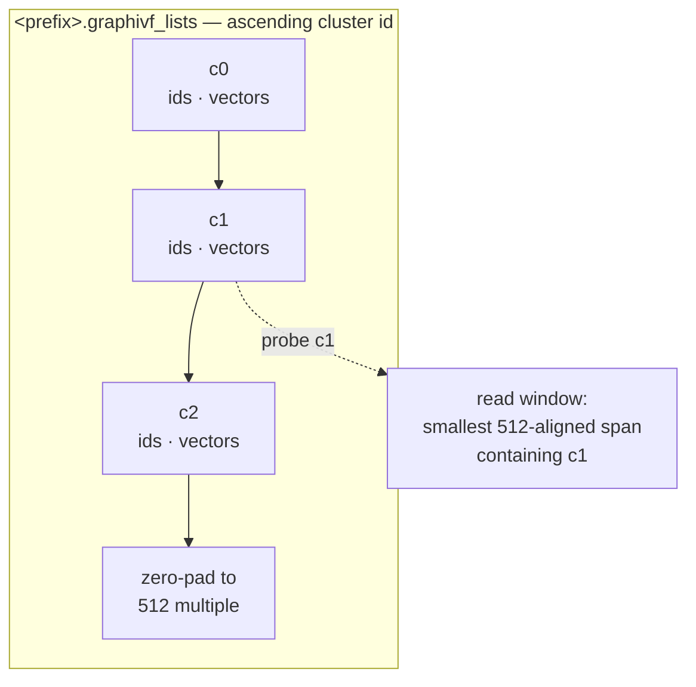
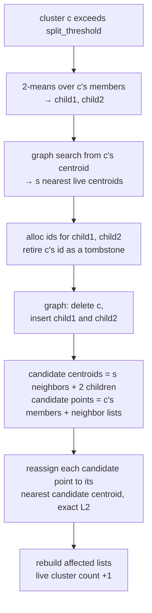

<!--
 Copyright (c) Microsoft Corporation.
 Licensed under the MIT license.
-->

# Online graph-IVF index — build & search

The **online graph-IVF index** is an inverted-file (IVF) ANN index whose
partition is built **incrementally**, one point at a time, instead of by a
single batch k-means pass. Cluster centroids are organized in an in-memory
**Vamana graph** used both to route inserts during the build and to select
lists to probe at query time; the inverted lists themselves live on disk. The
index is built in memory and saved and served over disk.

This document describes the incremental clusterer
([`OnlineClusterer`](src/online.rs)) and the shared search path
([`Searcher`](src/index.rs)). For the batch build see
[`CentroidInit`](src/index.rs); the two builds differ only in how the partition
is produced, not in how it is stored or searched.

---

## High-level model

- **Two-level index.** Level 1 is a set of `k` centroids indexed by a Vamana
  graph (in memory, always `f32`). Level 2 is `k` variable-length **inverted
  lists** on disk, list `c` holding the stored vectors of the points assigned to
  centroid `c`.
- **Search = route then scan.** A query navigates the centroid graph to its
  `nlist` nearest centroids, reads those lists from disk, and exhaustively scores
  the query against their members.
- **Online build = stream, route, split/merge.** Points stream in and out:
  each insert is routed to its nearest centroid and appended; each delete removes
  the point from its list. When a cluster overflows `split_threshold` it is
  **split** and its neighbourhood locally **reassigned**. When one falls below
  `merge_threshold` it is **merged** — retired from the centroid graph and its
  members scattered onto the survivors. The centroid count grows with inserts and
  contracts with merges; it is not fixed up front.


### Key assumptions & scope

- **In-memory build.** The driver loads the stored corpus `T` and decodes a full
  `f32` copy for clustering (row `pid` = point `pid`). It then "streams" points
  by feeding row indices to `insert_batch`; there is no per-insert disk I/O. This
  is not an out-of-core builder, so budget memory for both representations.
- **Clustering is always squared-L2.** Routing, 2-means splits, and reassignment
  all run in full-precision `f32` under squared-L2. The configured
  [`Metric`](src/params.rs) controls search-time routing/scoring after load. For
  cosine-style or normalized inner-product data, the caller must pre-normalize
  corpus and query vectors; `--normalize` normalizes centroids, not the input.
- **Decoupled clustering vs. stored precision.** Clustering uses `f32`, but the
  inverted lists are written from the corpus in its on-disk element type `T`,
  copied verbatim at flush. `T` is chosen at build time with `data_type`
  (`minmax8` — 1 B/component, `float16` — 2 B, or `float32` — 4 B; `uint8` and
  `int8` are also supported). Only the element *size* is recorded in the metadata,
  and `load` checks it against the requested `T` — enough to catch `float16` vs
  `float32`, not enough to distinguish `uint8` from `int8`. The centroid graph is
  always `f32`.
- **Single writer.** The build is single-threaded at the insert level (a thread
  pool is used only inside 2-means and graph construction). There is no
  concurrent insert/search; the index is immutable once flushed.

---

## Quick start

A build and its `nlist` sweep are one job in a benchmark config. `split_threshold` is
the only required knob; everything else has a default (full field reference in the
[graph-IVF section of
`diskann-benchmark/README.md`](../diskann-benchmark/README.md#graph-ivf)).

```json
{
  "type": "graph-ivf",
  "content": {
    "source": {
      "graph-ivf-source": "Online",
      "data_type": "float16",
      "data": "corpus_f16.bin",
      "distance": "squared_l2",
      "dim": 384,
      "split_threshold": 106,
      "batch_size": 4096,
      "reassign_neighbors": 5,
      "max_clusters": 16384,
      "graph_degree": 32,
      "graph_slack": 1.2,
      "graph_l_build": 64,
      "graph_alpha": 1.2,
      "num_threads": 16,
      "seed": 0,
      "save_path": "/abs/path/out_prefix_th106_f16",
      "telemetry_csv": "/abs/path/out_prefix_th106_f16.splits.csv"
    },
    "search_phase": {
      "queries": "queries_f16.bin",
      "groundtruth": "groundtruth.bin",
      "num_threads": 1,
      "nlist": [164, 410, 656, 901, 1147, 1638, 2458],
      "centroid_search_l": 1024,
      "recall_at": [50, 1000],
      "distance": "squared_l2"
    }
  }
}
```

```sh
cargo run --release --package diskann-benchmark --features graph-ivf -- \
    run --input-file online.json --output-file output.json
```

The build writes `<save_path>.graphivf_*` plus the telemetry CSV if one was asked for.
Queries must be in the same element type as the corpus, and the groundtruth must reach at
least the largest `recall_at` — every listed `k` is scored from one search per `nlist`,
so a list costs no more queries than a single value. A later `Load` job pointed at
the same prefix re-sweeps the index without rebuilding it; give it the same `data_type`
the index was built with.

---

## On-disk format (shared with the batch build)

Written next to a path prefix by `flush` (see [`storage`](src/storage.rs)):

| File | Contents |
| --- | --- |
| `<prefix>.graphivf_centroids.fbin` | The `k × logical_dim` centroid matrix, always `f32`. |
| `<prefix>.graphivf_lists` | Per cluster, in ascending id order: `[ids: u32 × count][vectors: T × stored_width × count]`, packed back-to-back. Each record start is 4-byte aligned; the file is zero-padded to a 512-byte multiple. |
| `<prefix>.graphivf_meta` | Fixed header — `magic`, `version`, `metric`, `element_size`, `dim` (the stored row width; `u32` each), `num_points`, `num_clusters` (`u64`), graph params (`degree`, `l_build`, `slack`, `alpha`) — followed by per-cluster counts. List offsets are recomputed from the counts on load. |

Lists are variable length with no per-list disk padding. A read for cluster `c`
fetches the smallest 512-aligned window that fully contains its list and indexes
into it. For plain `f16`/`f32`, `stored_width == logical_dim`; MinMax8 rows also
contain per-row quantization metadata, so their stored width is larger.



The online build additionally emits a per-split telemetry CSV at the configured
`telemetry_csv` path — see [Telemetry](#telemetry) — which is **not** part of the
loadable index.

---

## Build algorithm

Driver: a `"graph-ivf-source": "Online"` job in the benchmark harness.
Core: [`OnlineClusterer`](src/online.rs).

### 1. Seed the initial centroids

The clusterer starts from a small initial centroid set, chosen by a
[`SeedStrategy`](src/online.rs):

- **`Warmup { num_centroids, warmup_points, iters }`** (used by the harness): run an exact
  k-means (Forgy init + `iters` Lloyd iterations) over the **first**
  `warmup_points` corpus points. `warmup_points` is clamped to
  `[num_centroids, corpus_len]`. The config exposes these as `warmup_centroids`,
  `warmup_points` and `warmup_iters` (default 100 / 10000 / 15).
- **`Explicit(matrix)`** (library API): use a precomputed centroid matrix as-is.

The initial centroids are inserted into a **mutable Vamana centroid graph**
(`degree` R, `slack`, `l_build`, `alpha`; L2 navigation), pre-allocated to
`centroid_capacity` id slots.

### 2. Insert a point (route)

For each streamed point `pid`:

1. **Route** it to its nearest live centroid `c` by searching the centroid graph
   with search-list size `assign_l` (`assign_nearest`). Because splits leave
   **tombstoned** (soft-deleted) slots in the graph, a narrow beam can rarely
   return no live centroid; the router then retries with a widened list
   (`max(8·assign_l, 512)`) and, as a last resort, falls back to a brute-force
   scan over the live centroids.
2. **Append** `pid` to list `c` and record `assignments[pid] = c`.
3. **Maybe split:** if `len(list[c]) > split_threshold`, and the optional
   `max_clusters` cap is not yet reached, and the id budget can fit two more
   centroids, trigger a split of `c`.

Routing an insert never changes the partition unless it triggers a split, so
**splits are the only structural events** in the build.

This is the semantics of `batch_size: 1`. Larger batches defer splitting to the
end of the batch — see [Batched inserts](#3b-batched-inserts).


### 3. Split a cluster (split-and-reassign)

`split(c)` turns one overflowing cluster into two and re-optimizes its local
neighborhood:

1. **2-means.** Run a local Lloyd 2-means (`two_means_iters`, seeded from two
   distinct members) over `c`'s members, producing two child centroids
   (L2-normalized if `normalize_centroids`).
2. **Select neighbor clusters.** Search `c`'s own centroid vector in the
   centroid graph and take the `reassign_neighbors` (`s`) nearest **live**
   centroids, excluding `c` (done before deleting `c`). The search uses a
   search-list of `max(reassign_l, s + 1)`.
3. **Update centroid table.** Allocate two fresh ids for the children; **retire**
   `c`'s id (soft-delete — its id is never reused).
4. **Mutate the graph.** Delete `c` and insert the two children into the centroid
   graph.
5. **Reassign the neighborhood.** Form
   - *candidate centroids* = selected neighbors ∪ {child₁, child₂}
   - *candidate points* = `c`'s members ∪ all points of the neighbor clusters

   and reassign every candidate point to its nearest candidate centroid by exact
   squared-L2, rebuilding the affected lists. The distances are computed as
   `‖p‖² − 2p·c + ‖c‖²` over a `tile × |candidates|` GEMM rather than a scalar
   loop per point, which is what makes a large `reassign_neighbors` affordable;
   points stream through a fixed-size tile so the gathered working set stays
   bounded regardless of region size. Every member of the retired cluster
   necessarily moves (its old id is not a candidate); a neighbor point counts as
   "reassigned" only if it lands on a different centroid than before.

Each split is a net **+1** to the live-cluster count (−1 retired, +2 children).



Only `c` and the `reassign_neighbors` clusters selected by graph search are
touched; the rest of the partition is unchanged, keeping each split's cost
**local**.

### 3b. Batched inserts

Steps 2 and 3 describe a batch of one. There is only one write path —
`insert_batch`; `batch_size` says how many points the harness hands it at a time.
A real writer arrives with thousands, and the larger the batch the more of the
schedule opens up.

The change that makes everything else possible is **deferring splits to the end
of the batch**. Nothing mutates the centroid graph while a batch is being routed,
so the batch is processed in three phases:

1. **Route.** All `N` routes are read-only against a frozen graph, so a batch
   large enough to fill more than one work unit is spread across the thread
   pool (per-worker current-thread runtimes). A batch too small to be worth the
   dispatch runs on the clusterer's own runtime.
2. **Split jointly.** Every routed-to cluster now holding more than
   `split_threshold` points is collected as a split parent `c₁ … c_l`. Their
   inverted lists are unioned into `X = X₁ ∪ … ∪ X_l` and re-clustered by **one**
   k-means into `2l` children — two seeds drawn per parent, `two_means_iters`
   Lloyd iterations, centroids re-normalized each iteration if
   `normalize_centroids`. With `l = 1` this is exactly the local 2-means of step
   3.1. With more, clusters that overflow in the same batch are usually
   adjacent, so the joint pass lets their boundaries settle against one another
   instead of each parent bisecting itself greedily. The `l` parents are then
   retired and the `2l` children published to the graph together.
3. **Reassign per region.** Each parent's region is then reassigned in turn,
   exactly as in step 3.5: the candidates are the parent's own two children plus
   the `reassign_neighbors` nearest live centroids selected *before* the
   mutation, and the candidate points are the parent's members plus everything
   those neighbors hold. A neighbor that was itself a parent of this batch has
   been retired and drops out — its region is covered by its own turn.

Admission control still applies per batch: a split costs two ids and adds one
live cluster, so when a batch would breach `max_clusters` or the id budget the
most overfull clusters split first and the rest wait for a later batch.

At `l = 1` every phase reduces to the serial description above, so `batch_size:
1` is the reference semantics and larger batches differ only where the joint
k-means and the deferred routing actually bite: points routed against the
pre-batch partition (phase 3 re-examines exactly the regions that moved), and
overflowing clusters bisected together rather than one at a time. Telemetry
coarsens to match — one `SplitEvent` per split parent still, but every event from
one batch shares that batch's `insert_index` and `live_after`, and
`two_means_us` is the parent's share of the joint k-means prorated by member
count.

Measured on enron-1M (1,087,932 × 384 minmax8, `split_threshold` 759,
`reassign_neighbors` 32, 16 threads), `batch_size: 4096` against the same build
at `batch_size: 1`:

| | `batch_size: 1` | `batch_size: 4096` |
| --- | --- | --- |
| build | 138.0 s | **84.7 s** (1.6×) |
| routing | 52.5 s | 7.5 s |
| split | 84.5 s | 77.1 s |
| live clusters | 2012 | 2055 |
| points reassigned | 1,873,198 | 1,933,702 |
| residual | 6.345e5 | 6.347e5 |
| recall@50, `nlist` 307 | 92.49 | 91.90 |

Nearly all of it is routing: that phase is embarrassingly parallel once the
graph is frozen and drops 7×, while splitting stays serial per parent and gains
only what the joint k-means saves. Recall tracks the serial build to within a
point, at the same residual.

### 3c. Delete a point (remove, maybe merge)

`delete_batch(pids)` mirrors `insert_batch` in three phases:

1. **Group.** Each point is paired with the cluster it currently sits in
   (`assignments[pid]`). The batch is sorted by (cluster, pid) so each touched
   cluster's victims are already in order for the next phase. A repeated pid
   in one batch is deduplicated silently — removing a point twice is idempotent.
2. **Remove.** Each touched cluster's inverted list is filtered in one `retain`
   pass and each point's assignment is reset to `UNASSIGNED`. Cost is
   `O(|list|)` per touched cluster regardless of how many deletes hit it.
   A deleted point's id is free and may be re-inserted later.
3. **Maybe merge.** Any touched cluster now holding fewer than `merge_threshold`
   points is a **victim**. `merge_threshold = 0` (the default) disables merging;
   deletes still remove points but the partition only ever gains clusters.

The **merge operator** retires a victim and scatters its members:

1. Snapshot each victim's centroid vector and member list.
2. **Retire the whole batch first** — remove every victim from the centroid
   graph before placing any point. With victims already out of the graph the
   landing-site search can only return survivors, so a batch retiring mutually
   adjacent clusters needs no claiming or exclusion bookkeeping.
3. For each victim: search for the `reassign_neighbors` nearest surviving
   centroids from the victim's own centroid vector, then place the victim's
   members onto those survivors via the same `reassign_gemm` the split path uses.

A merge is a net **−1** to the live-cluster count, fits no new centroid, and
consumes **no centroid id** — merges are free against the id budget
(see [§4](#4-id-budget--termination)).

**The cascade rule:** `insert_batch` never merges; `delete_batch` never splits.
A survivor that absorbs a dissolved cluster's members may end up over
`split_threshold` — it waits for the next insert routed to it. This makes
split/merge cascades structurally impossible rather than bounded by a counter.

The `min_clusters` floor prevents the partition from collapsing entirely: merges
are admitted emptiest-first until the live count would fall below `min_clusters`.
The hysteresis requirement `2 × merge_threshold ≤ split_threshold` is validated
at construction to prevent a freshly-split child from immediately being eligible
for merging.

### 4. Id budget & termination

- `centroid_capacity` is the **total** id budget (live + retired). Ids consumed
  over a build is `initial + 2 · splits`; merges retire an id but never allocate
  one, so merges are free. Under long streaming churn, splits accumulate without
  bound — size `centroid_capacity` to cover the expected total over the full
  workload, not just the peak live count.
- `max_clusters = Some(k)` stops splitting at `k` live clusters (fixed
  granularity). `None` lets the count grow driven solely by `split_threshold`;
  the natural equilibrium is `≈ 2 · num_points / split_threshold` live clusters.

The example maps `--max-clusters 0` to `None` and auto-sizes the id budget from
the corpus size, threshold, `--capacity-mult` (default 3), warmup size, and any
cluster cap. Users of the library API provide `centroid_capacity` directly.

### 5. Flush

`flush` serializes the in-memory mapping to the on-disk format above:

1. Densely remap the live centroid ids to a contiguous `0..k`.
2. Write the `k × dim` centroids (`f32`).
3. Write the inverted lists from the **stored** corpus `T` (verbatim) in remapped
   id order, and write the metadata (counts, `dim`, `metric`, element size,
   graph params). Points not currently in the index — never inserted, or deleted
   since the last flush — are marked `UNASSIGNED` and **skipped**. The ids
   written into each list are the original corpus row indices either way, so a
   partial index refers to points by their corpus position and groundtruth keeps
   lining up.

The output loads through
[`GraphIvfIndex::<T>::load`](src/index.rs) exactly like a batch-built index.

---

## Search algorithm

Per-thread [`Searcher::search`](src/index.rs) (one searcher per thread). Given a
query in the stored type `T` and target `k`:


1. **Preprocess.** Build a `T`-space scorer once (query and corpus are both `T`,
   so scoring needs no per-candidate decode). Decode the query to `f32` once for
   the centroid graph (a no-op when `T == f32`). Scoring metric: squared-L2 for
   `L2`/`Cosine`, negated inner product for `InnerProduct` — all "smaller is
   better".
2. **Centroid KNN.** Search the centroid graph for the query's nearest `nlist`
   centroids, using search-list size `effective_l = max(centroid_search_l,
   nlist)`. These are the lists to probe.
3. **Plan I/O.** For each non-empty probed cluster, compute the smallest
   512-aligned byte window that fully contains its list, and carve each a
   disjoint slice of **one reusable 512-aligned buffer** (grown only when a query
   needs more space than any prior one — steady state does no allocation).
4. **Batched read.** Issue all probed-list reads as a **single batch** through
   the platform aligned reader (io_uring on Linux, IOCP on Windows, buffered
   elsewhere), with direct/unbuffered I/O bypassing the OS page cache.
5. **Score.** Parse each fetched cluster into `(ids, vectors)` and exhaustively
   score the query against every stored vector directly in `T`.
6. **Top-k.** `select_nth` + sort ascending by score; return the `k` best
   `(id, score)` pairs.

End-to-end recall is therefore capped by two things: whether the centroid graph
returns the *truly* nearest `nlist` centroids (increase `centroid_search_l` /
`nlist`), and whether the target neighbors actually live in those lists (a
function of clustering quality — the reason for the split-and-reassign build).

---

## Parameters and tuning

Online build ([`OnlineParams`](src/params.rs)):

| Parameter | Role |
| --- | --- |
| `split_threshold` | A cluster splits once it holds **more** than this many points (`≥ 2`). The dominant knob on final granularity. |
| `merge_threshold` | A cluster is retired once deletes shrink it below this many points. `0` (the default) disables merging. Requires `2 × merge_threshold ≤ split_threshold`. |
| `min_clusters` | Live-cluster floor: merges stop before taking the count below this (clamped to `≥ 1` internally). |
| `max_clusters` | Optional hard cap on live clusters (`None` = data-driven growth). |
| `centroid_capacity` | Total id budget (live + retired); size to `≈ 2×` expected final clusters. |
| `assign_l` | Centroid-graph search-list size for routing inserts. |
| `reassign_neighbors` | Number of nearest centroid clusters (besides the two children) pooled as reassignment candidates on a split (`≥ 1`). |
| `reassign_l` | Centroid-graph search-list size for the nearest-centroid search that selects `reassign_neighbors` (clamped up to `reassign_neighbors + 1`). |
| `two_means_iters` | Lloyd iterations per split 2-means (internally at least one). |
| `graph` | Centroid-graph build params: `degree` (R), `slack`, `l_build`, `alpha`. |
| `metric` | Search-time routing/scoring metric recorded in the index (clustering is always L2). |
| `normalize_centroids` | L2-normalize warmup and child centroids (unit-sphere corpora). |
| `num_threads`, `seed` | Worker pool for warmup/2-means/graph build; RNG seed. |

Search ([`SearchParams`](src/params.rs)):

| Parameter | Role |
| --- | --- |
| `nlist` | Number of nearest centroids (lists) to probe (`≤ num_clusters`). |
| `centroid_search_l` | Centroid-graph search-list size; effective L is `max(centroid_search_l, nlist)`. |

Practical tuning order:

1. Pick `split_threshold` for the desired list size / cluster count; use
  `max_clusters` only when a hard cap is required.
2. Increase `reassign_neighbors` (and, if needed, `reassign_l`) when build
  quality matters more than split cost.
3. Sweep `nlist` to choose the query-time recall, I/O, and latency trade-off.
4. Raise `assign_l` or `centroid_search_l` only if routing quality is limiting
  build or search recall.

The complete field/default table is in the [graph-IVF section of
`diskann-benchmark/README.md`](../diskann-benchmark/README.md#graph-ivf).

---

## Telemetry

[`BuildTelemetry`](src/online.rs) records routing, split, delete, and merge
totals and one event per structural change. Setting `telemetry_csv` on the job
writes two files:

- **`<telemetry_csv>`** — one row per split, written by `write_csv`. Fields:
  triggering insert index, retired cluster and size, neighbor count, points that
  changed cluster, resulting live count, and 2-means/reassignment/total
  latencies.
- **`<stem>_merges.<ext>`** — one row per merge, written by `write_merges_csv`
  (sibling path derived automatically). Fields: operation index, retired cluster
  and its size, neighbor count, points re-placed, live count after the merge,
  and search/reassignment/total latencies.

The two files have different schemas and are kept separate so existing split
analysis scripts continue to work unchanged.
