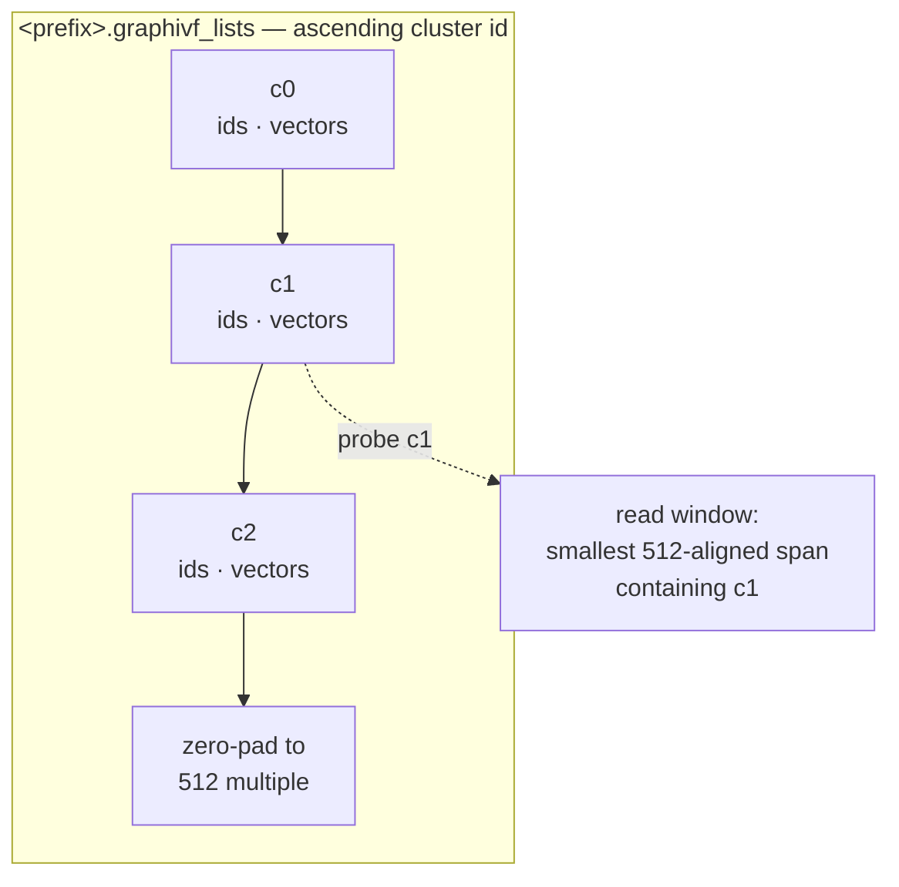
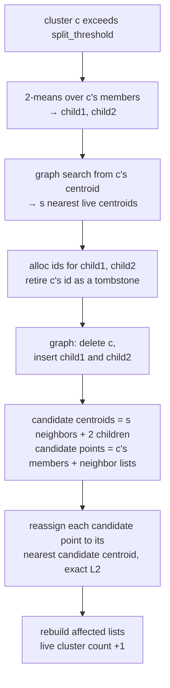
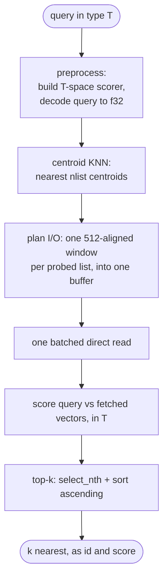

<!--
 Copyright (c) Microsoft Corporation.
 Licensed under the MIT license.
-->

# Online graph-IVF index — build & search

The **online graph-IVF index** is an inverted-file (IVF) ANN index whose
partition is built **incrementally**, one point at a time, instead of by a
single batch k-means pass. Cluster centroids are organized in an in-memory
**Vamana graph** used both to route inserts during the build and to select
lists to probe at query time; the inverted lists themselves live on disk. The
index is built in memory and saved and served over disk.

This document describes the incremental clusterer
([`OnlineClusterer`](src/online.rs)) and the shared search path
([`Searcher`](src/index.rs)). For the batch build see
[`CentroidInit`](src/index.rs); the two builds differ only in how the partition
is produced, not in how it is stored or searched.

---

## High-level model

- **Two-level index.** Level 1 is a set of `k` centroids indexed by a Vamana
  graph (in memory, always `f32`). Level 2 is `k` variable-length **inverted
  lists** on disk, list `c` holding the stored vectors of the points assigned to
  centroid `c`.
- **Search = route then scan.** A query navigates the centroid graph to its
  `nlist` nearest centroids, reads those lists from disk, and exhaustively scores
  the query against their members.
- **Online build = stream, route, split.** Points are streamed in insert order;
  each is routed to its nearest centroid via the same graph. When a cluster
  overflows a confugrable size threshold it is **split** in two and its neighborhood is
  locally **reassigned**. The centroid count is not fixed up front — it grows
  with the data.


### Key assumptions & scope

- **In-memory build.** The driver loads the stored corpus `T` and decodes a full
  `f32` copy for clustering (row `pid` = point `pid`). It then "streams" points
  by feeding row indices to `insert`; there is no per-insert disk I/O. This is
  not an out-of-core builder, so budget memory for both representations.
- **Clustering is always squared-L2.** Routing, 2-means splits, and reassignment
  all run in full-precision `f32` under squared-L2. The configured
  [`Metric`](src/params.rs) controls search-time routing/scoring after load. For
  cosine-style or normalized inner-product data, the caller must pre-normalize
  corpus and query vectors; `--normalize` normalizes centroids, not the input.
- **Decoupled clustering vs. stored precision.** Clustering uses `f32`, but the
  inverted lists are written from the corpus in its on-disk element type `T`,
  copied verbatim at flush. `T` is chosen at build time with `data_type`
  (`minmax8` — 1 B/component, `float16` — 2 B, or `float32` — 4 B; `uint8` and
  `int8` are also supported). Only the element *size* is recorded in the metadata,
  and `load` checks it against the requested `T` — enough to catch `float16` vs
  `float32`, not enough to distinguish `uint8` from `int8`. The centroid graph is
  always `f32`.
- **Single writer.** The build is single-threaded at the insert level (a thread
  pool is used only inside 2-means and graph construction). There is no
  concurrent insert/search; the index is immutable once flushed.

---

## Quick start

A build and its `nlist` sweep are one job in a benchmark config. `split_threshold` is
the only required knob; everything else has a default (full field reference in the
[graph-IVF section of
`diskann-benchmark/README.md`](../diskann-benchmark/README.md#graph-ivf)).

```json
{
  "type": "graph-ivf",
  "content": {
    "source": {
      "graph-ivf-source": "Online",
      "data_type": "float16",
      "data": "corpus_f16.bin",
      "distance": "squared_l2",
      "dim": 384,
      "split_threshold": 106,
      "reassign_neighbors": 5,
      "max_clusters": 16384,
      "graph_degree": 32,
      "graph_slack": 1.2,
      "graph_l_build": 64,
      "graph_alpha": 1.2,
      "num_threads": 16,
      "seed": 0,
      "save_path": "/abs/path/out_prefix_th106_f16",
      "telemetry_csv": "/abs/path/out_prefix_th106_f16.splits.csv"
    },
    "search_phase": {
      "queries": "queries_f16.bin",
      "groundtruth": "groundtruth.bin",
      "num_threads": 1,
      "nlist": [164, 410, 656, 901, 1147, 1638, 2458],
      "centroid_search_l": 1024,
      "recall_at": 50,
      "distance": "squared_l2"
    }
  }
}
```

```sh
cargo run --release --package diskann-benchmark --features graph-ivf -- \
    run --input-file online.json --output-file output.json
```

The build writes `<save_path>.graphivf_*` plus the telemetry CSV if one was asked for.
Queries must be in the same element type as the corpus. A later `Load` job pointed at
the same prefix re-sweeps the index without rebuilding it; give it the same `data_type`
the index was built with.

---

## On-disk format (shared with the batch build)

Written next to a path prefix by `flush` (see [`storage`](src/storage.rs)):

| File | Contents |
| --- | --- |
| `<prefix>.graphivf_centroids.fbin` | The `k × logical_dim` centroid matrix, always `f32`. |
| `<prefix>.graphivf_lists` | Per cluster, in ascending id order: `[ids: u32 × count][vectors: T × stored_width × count]`, packed back-to-back. Each record start is 4-byte aligned; the file is zero-padded to a 512-byte multiple. |
| `<prefix>.graphivf_meta` | Fixed header — `magic`, `version`, `metric`, `element_size`, `dim` (the stored row width; `u32` each), `num_points`, `num_clusters` (`u64`), graph params (`degree`, `l_build`, `slack`, `alpha`) — followed by per-cluster counts. List offsets are recomputed from the counts on load. |

Lists are variable length with no per-list disk padding. A read for cluster `c`
fetches the smallest 512-aligned window that fully contains its list and indexes
into it. For plain `f16`/`f32`, `stored_width == logical_dim`; MinMax8 rows also
contain per-row quantization metadata, so their stored width is larger.



The online build additionally emits a per-split telemetry CSV at the configured
`telemetry_csv` path — see [Telemetry](#telemetry) — which is **not** part of the
loadable index.

---

## Build algorithm

Driver: a `"graph-ivf-source": "Online"` job in the benchmark harness.
Core: [`OnlineClusterer`](src/online.rs).

### 1. Seed the initial centroids

The clusterer starts from a small initial centroid set, chosen by a
[`SeedStrategy`](src/online.rs):

- **`Warmup { num_centroids, warmup_points, iters }`** (used by the harness): run an exact
  k-means (Forgy init + `iters` Lloyd iterations) over the **first**
  `warmup_points` corpus points. `warmup_points` is clamped to
  `[num_centroids, corpus_len]`. The config exposes these as `warmup_centroids`,
  `warmup_points` and `warmup_iters` (default 100 / 10000 / 15).
- **`Explicit(matrix)`** (library API): use a precomputed centroid matrix as-is.

The initial centroids are inserted into a **mutable Vamana centroid graph**
(`degree` R, `slack`, `l_build`, `alpha`; L2 navigation), pre-allocated to
`centroid_capacity` id slots.

### 2. Insert a point (route)

For each streamed point `pid` (`insert`):

1. **Route** it to its nearest live centroid `c` by searching the centroid graph
   with search-list size `assign_l` (`assign_nearest`). Because splits leave
   **tombstoned** (soft-deleted) slots in the graph, a narrow beam can rarely
   return no live centroid; the router then retries with a widened list
   (`max(8·assign_l, 512)`) and, as a last resort, falls back to a brute-force
   scan over the live centroids.
2. **Append** `pid` to list `c` and record `assignments[pid] = c`.
3. **Maybe split:** if `len(list[c]) > split_threshold`, and the optional
   `max_clusters` cap is not yet reached, and the id budget can fit two more
   centroids, trigger a split of `c`.

Routing an insert never changes the partition unless it triggers a split, so
**splits are the only structural events** in the build.


### 3. Split a cluster (split-and-reassign)

`split(c)` turns one overflowing cluster into two and re-optimizes its local
neighborhood:

1. **2-means.** Run a local Lloyd 2-means (`two_means_iters`, seeded from two
   distinct members) over `c`'s members, producing two child centroids
   (L2-normalized if `normalize_centroids`).
2. **Select neighbor clusters.** Search `c`'s own centroid vector in the
   centroid graph and take the `reassign_neighbors` (`s`) nearest **live**
   centroids, excluding `c` (done before deleting `c`). The search uses a
   search-list of `max(reassign_l, s + 1)`.
3. **Update centroid table.** Allocate two fresh ids for the children; **retire**
   `c`'s id (soft-delete — its id is never reused).
4. **Mutate the graph.** Delete `c` and insert the two children into the centroid
   graph.
5. **Reassign the neighborhood.** Form
   - *candidate centroids* = selected neighbors ∪ {child₁, child₂}
   - *candidate points* = `c`'s members ∪ all points of the neighbor clusters

   and reassign every candidate point to its nearest candidate centroid by exact
   squared-L2, rebuilding the affected lists. Every member of the retired cluster
   necessarily moves (its old id is not a candidate); a neighbor point counts as
   "reassigned" only if it lands on a different centroid than before.

Each split is a net **+1** to the live-cluster count (−1 retired, +2 children).



Only `c` and the `reassign_neighbors` clusters selected by graph search are
touched; the rest of the partition is unchanged, keeping each split's cost
**local**.

### 4. Id budget & termination

- `centroid_capacity` is the **total** id budget (live + retired). Ids consumed
  over a build is `initial + 2 · splits`; size it to roughly **2×** the expected
  final live-cluster count. Splitting stops when the budget is exhausted.
- `max_clusters = Some(k)` stops splitting at `k` live clusters (fixed
  granularity). `None` lets the count grow driven solely by `split_threshold`;
  the natural equilibrium is `≈ 2 · num_points / split_threshold` live clusters.

The example maps `--max-clusters 0` to `None` and auto-sizes the id budget from
the corpus size, threshold, `--capacity-mult` (default 3), warmup size, and any
cluster cap. Users of the library API provide `centroid_capacity` directly.

### 5. Flush

`flush` serializes the in-memory mapping to the on-disk format above:

1. Densely remap the live centroid ids to a contiguous `0..k`.
2. Write the `k × dim` centroids (`f32`).
3. Write the inverted lists from the **stored** corpus `T` (verbatim) in remapped
   id order, and write the metadata (counts, `dim`, `metric`, element size,
   graph params).

The output loads through
[`GraphIvfIndex::<T>::load`](src/index.rs) exactly like a batch-built index.

---

## Search algorithm

Per-thread [`Searcher::search`](src/index.rs) (one searcher per thread). Given a
query in the stored type `T` and target `k`:



1. **Preprocess.** Build a `T`-space scorer once (query and corpus are both `T`,
   so scoring needs no per-candidate decode). Decode the query to `f32` once for
   the centroid graph (a no-op when `T == f32`). Scoring metric: squared-L2 for
   `L2`/`Cosine`, negated inner product for `InnerProduct` — all "smaller is
   better".
2. **Centroid KNN.** Search the centroid graph for the query's nearest `nlist`
   centroids, using search-list size `effective_l = max(centroid_search_l,
   nlist)`. These are the lists to probe.
3. **Plan I/O.** For each non-empty probed cluster, compute the smallest
   512-aligned byte window that fully contains its list, and carve each a
   disjoint slice of **one reusable 512-aligned buffer** (grown only when a query
   needs more space than any prior one — steady state does no allocation).
4. **Batched read.** Issue all probed-list reads as a **single batch** through
   the platform aligned reader (io_uring on Linux, IOCP on Windows, buffered
   elsewhere), with direct/unbuffered I/O bypassing the OS page cache.
5. **Score.** Parse each fetched cluster into `(ids, vectors)` and exhaustively
   score the query against every stored vector directly in `T`.
6. **Top-k.** `select_nth` + sort ascending by score; return the `k` best
   `(id, score)` pairs.

End-to-end recall is therefore capped by two things: whether the centroid graph
returns the *truly* nearest `nlist` centroids (increase `centroid_search_l` /
`nlist`), and whether the target neighbors actually live in those lists (a
function of clustering quality — the reason for the split-and-reassign build).

---

## Parameters and tuning

Online build ([`OnlineParams`](src/params.rs)):

| Parameter | Role |
| --- | --- |
| `split_threshold` | A cluster splits once it holds **more** than this many points (`≥ 2`). The dominant knob on final granularity. |
| `max_clusters` | Optional hard cap on live clusters (`None` = data-driven growth). |
| `centroid_capacity` | Total id budget (live + retired); size to `≈ 2×` expected final clusters. |
| `assign_l` | Centroid-graph search-list size for routing inserts. |
| `reassign_neighbors` | Number of nearest centroid clusters (besides the two children) pooled as reassignment candidates on a split (`≥ 1`). |
| `reassign_l` | Centroid-graph search-list size for the nearest-centroid search that selects `reassign_neighbors` (clamped up to `reassign_neighbors + 1`). |
| `two_means_iters` | Lloyd iterations per split 2-means (internally at least one). |
| `graph` | Centroid-graph build params: `degree` (R), `slack`, `l_build`, `alpha`. |
| `metric` | Search-time routing/scoring metric recorded in the index (clustering is always L2). |
| `normalize_centroids` | L2-normalize warmup and child centroids (unit-sphere corpora). |
| `num_threads`, `seed` | Worker pool for warmup/2-means/graph build; RNG seed. |

Search ([`SearchParams`](src/params.rs)):

| Parameter | Role |
| --- | --- |
| `nlist` | Number of nearest centroids (lists) to probe (`≤ num_clusters`). |
| `centroid_search_l` | Centroid-graph search-list size; effective L is `max(centroid_search_l, nlist)`. |

Practical tuning order:

1. Pick `split_threshold` for the desired list size / cluster count; use
  `max_clusters` only when a hard cap is required.
2. Increase `reassign_neighbors` (and, if needed, `reassign_l`) when build
  quality matters more than split cost.
3. Sweep `nlist` to choose the query-time recall, I/O, and latency trade-off.
4. Raise `assign_l` or `centroid_search_l` only if routing quality is limiting
  build or search recall.

The complete field/default table is in the [graph-IVF section of
`diskann-benchmark/README.md`](../diskann-benchmark/README.md#graph-ivf).

---

## Telemetry

[`BuildTelemetry`](src/online.rs) records routing/split totals and one event per
split: triggering insert, retired cluster and size, neighbor count, points that
changed cluster, resulting live-cluster count, and 2-means/reassignment/total
latencies. Setting `telemetry_csv` on the job writes those events out. Because splits
are the only structural events, the CSV is a complete timeline of cluster-count growth
and split cost.
