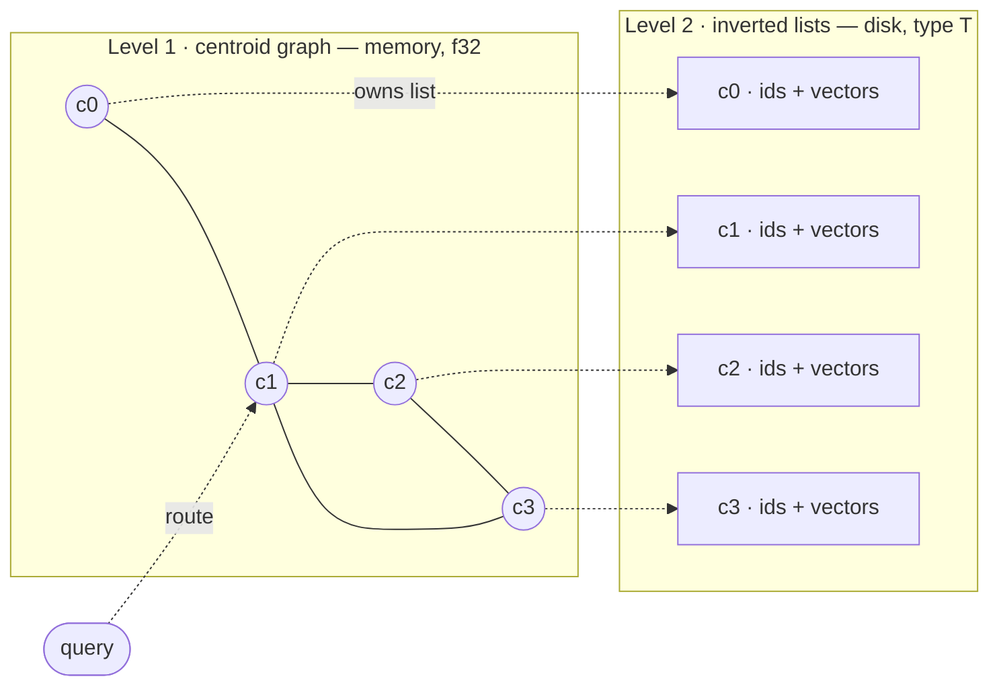
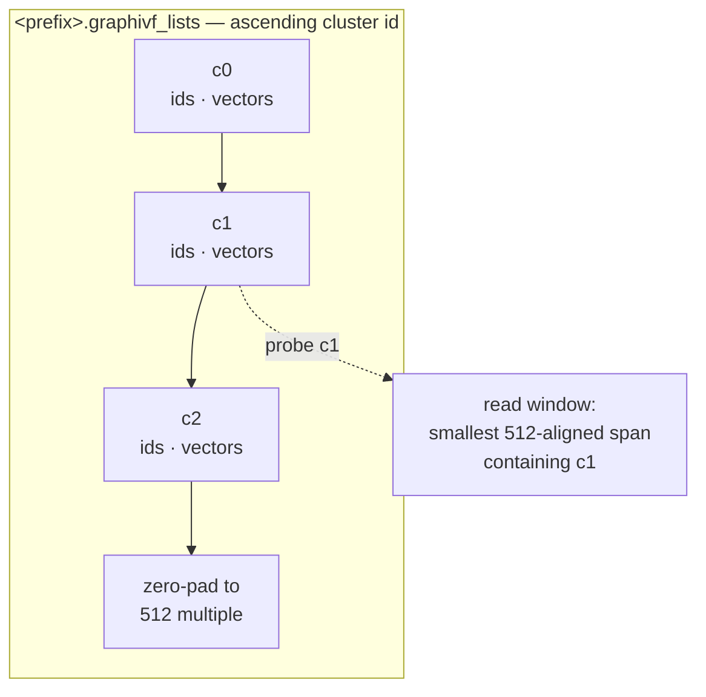
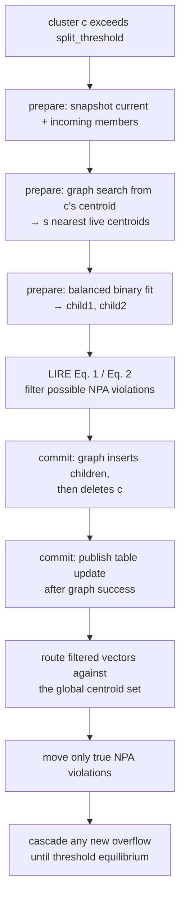

<!--
 Copyright (c) Microsoft Corporation.
 Licensed under the MIT license.
-->

# Online graph-IVF index — build & search

The **online graph-IVF index** is an inverted-file (IVF) ANN index whose
partition is built **incrementally**, one point at a time, instead of by a
single batch k-means pass. Cluster centroids are organized in an in-memory
**Vamana graph** used both to route inserts during the build and to select
lists to probe at query time; the inverted lists themselves live on disk. The
index is built in memory and saved and served over disk.

This document describes the incremental clusterer
([`OnlineClusterer`](src/online.rs)), its live in-memory query handle
([`OnlineSearcher`](src/online/search.rs)), and the shared flushed-index search
path ([`Searcher`](src/index.rs)). For the batch build see
[`CentroidInit`](src/index.rs); the two builds differ only in how the partition
is produced, not in how it is stored or searched.

The implementation is split by responsibility: [`online.rs`](src/online.rs)
orchestrates mutations and flush, [`state.rs`](src/online/state.rs) owns centroid and
partition state, [`search.rs`](src/online/search.rs) implements live queries,
[`seed.rs`](src/online/seed.rs) initializes centroids, and
[`telemetry.rs`](src/online/telemetry.rs) records split/merge events.

---

## High-level model

- **Two-level index.** Level 1 is a set of `k` centroids indexed by a Vamana
  graph (in memory, always `f32`). Level 2 is `k` variable-length **inverted
  lists** on disk, list `c` holding the stored vectors of the points assigned to
  centroid `c`.
- **Search = route then scan.** A query navigates the centroid graph to its
  `nlist` nearest centroids, reads those lists from disk, and exhaustively scores
  the query against their members.
- **Online build = stream, route, LIRE split/merge.** Points stream in and out:
  each insert is routed to its nearest centroid and appended; each delete removes
  the point from its list. When a cluster overflows `split_threshold` it is
  **split** and its neighbourhood locally **reassigned**. When one falls below
   `merge_threshold` it is **merged** — retired from the centroid graph and its
   members globally rerouted for NPA. The centroid count grows with splits and
   contracts with merges; it is not fixed up front.



### Key assumptions & scope

- **In-memory build.** The driver loads the stored corpus `T` and decodes a full
  `f32` copy for clustering (row `pid` = point `pid`). It then "streams" points
  by feeding row indices to `insert_batch`; there is no per-insert disk I/O. This
  is not an out-of-core builder, so budget memory for both representations.
- **Clustering is always squared-L2.** Routing, balanced splits, and reassignment
  all run in full-precision `f32` under squared-L2. The configured
  [`Metric`](src/params.rs) controls search-time routing/scoring after load. For
  cosine-style or normalized inner-product data, the caller must pre-normalize
  corpus and query vectors; `--normalize` normalizes centroids, not the input.
- **Decoupled clustering vs. stored precision.** Clustering uses `f32`, but the
  inverted lists are written from the corpus in its on-disk element type `T`,
  copied verbatim at flush. `T` is chosen at build time with `data_type`
  (`minmax8` — 1 B/component, `float16` — 2 B, or `float32` — 4 B; `uint8` and
  `int8` are also supported). Only the element *size* is recorded in the metadata,
  and `load` checks it against the requested `T` — enough to catch `float16` vs
  `float32`, not enough to distinguish `uint8` from `int8`. The centroid graph is
  always `f32`.
- **Exclusive mutation.** Insert and delete operations require mutable access to
   the clusterer. A live `OnlineSearcher` immutably borrows it, so Rust prevents a
   mutation while any query handle is alive. Multiple handles may be opened and
   driven in parallel, one per worker. The on-disk index is immutable after flush.

---

## Quick start

A build and its cluster-fraction sweep can be one job in a benchmark config. The corpus,
metric, dimensions, centroid-graph parameters, threads, seed, output prefix, and
`split_threshold` are required; online-specific tuning fields have documented defaults
(full field reference in the [graph-IVF section of
`diskann-benchmark/README.md`](../diskann-benchmark/README.md#graph-ivf)).

```json
{
  "type": "graph-ivf",
  "content": {
    "source": {
      "graph-ivf-source": "Online",
      "data_type": "float16",
      "data": "corpus_f16.bin",
      "distance": "squared_l2",
      "dim": 384,
      "split_threshold": 106,
      "batch_size": 4096,
      "reassign_neighbors": 5,
      "max_clusters": 16384,
      "routing": { "graph": { "graph_degree": 32, "graph_slack": 1.2, "graph_l_build": 64, "graph_alpha": 1.2 } },
      "num_threads": 16,
      "seed": 0,
      "save_path": "/abs/path/out_prefix_th106_f16",
      "telemetry_csv": "/abs/path/out_prefix_th106_f16.splits.csv"
    },
    "search_phase": {
      "queries": "queries_f16.bin",
      "groundtruth": "groundtruth.bin",
      "num_threads": 1,
      "cluster_fractions": [0.01, 0.025, 0.04, 0.055, 0.07, 0.1, 0.15],
      "centroid_search_alpha": 4.0,
      "recall_at": [50, 1000],
      "distance": "squared_l2"
    }
  }
}
```

```sh
cargo run --release --package diskann-benchmark --features graph-ivf -- \
    run --input-file online.json --output-file output.json
```

The build writes `<save_path>.graphivf_*` plus the split telemetry CSV if one was asked for.
Queries must be in the same element type as the corpus, and the groundtruth must reach at
least the largest `recall_at` — every listed `k` is scored from one search per cluster
fraction, so a list costs no more queries than a single value. Each fraction must be in
`(0.0, 1.0]`; the benchmark rounds `fraction * live_clusters` up to the concrete `nlist`
and reports both. A runbook recomputes that value at every search stage. A later `Load` job
pointed at the same prefix re-sweeps the index without rebuilding it; give it the same
`data_type` the index was built with.

---

## On-disk format (shared with the batch build)

Written next to a path prefix by `flush` (see [`storage`](src/storage.rs)):

| File | Contents |
| --- | --- |
| `<prefix>.graphivf_centroids.fbin` | The `k × logical_dim` centroid matrix, always `f32`. |
| `<prefix>.graphivf_lists` | Per cluster, in ascending id order: `[ids: u32 × count][vectors: T × stored_width × count]`, packed back-to-back. Each record start is 4-byte aligned; the file is zero-padded to a 512-byte multiple. |
| `<prefix>.graphivf_meta` | Fixed header — `magic`, `version`, `metric`, `element_size`, `dim` (the stored row width; `u32` each), `num_points`, `num_clusters` (`u64`), graph params (`degree`, `l_build`, `slack`, `alpha`), and whether a centroid graph was persisted (`u32` flag) — followed by per-cluster counts. List offsets are recomputed from the counts on load. |
| `<prefix>.graphivf_graph` | The centroid graph's adjacency in centroid-id space: node count, then the frozen start point's out-edges followed by each centroid's, every list a `u32` length and that many `u32` ids. Written under the same dense renumbering as the centroid matrix, so a load replays the graph rather than rebuilding it. Absent when routing exactly. |

Lists are variable length with no per-list disk padding. A read for cluster `c`
fetches the smallest 512-aligned window that fully contains its list and indexes
into it. For plain `f16`/`f32`, `stored_width == logical_dim`; MinMax8 rows also
contain per-row quantization metadata, so their stored width is larger.



The plain online build can additionally emit a per-split telemetry CSV at the
configured `telemetry_csv` path. A runbook build also derives a sibling merge CSV
at `<stem>_merges.<ext>` — see [Telemetry](#telemetry). Neither file is part of
the loadable index.

---

## Build algorithm

Drivers: an `"Online"` job for one insert-only pass, or an `"OnlineRunbook"`
job for staged insert/delete/search churn, in the benchmark harness.
Core: [`OnlineClusterer`](src/online.rs).

### 1. Seed the initial centroids

The clusterer starts from a small initial centroid set, chosen by a
[`SeedStrategy`](src/online/seed.rs):

- **`Warmup { num_centroids, warmup_points, iters }`** (used by the harness): run an exact
  k-means (Forgy init + `iters` Lloyd iterations) over the **first**
  `warmup_points` corpus points. `warmup_points` is clamped to
   `[num_centroids, corpus_len]`; `iters = 0` uses the sampled points without
   Lloyd refinement. The config exposes these as `warmup_centroids`,
   `warmup_points` and `warmup_iters` (default 100 / 10000 / 15).
- **`Explicit(matrix)`** (library API): use a precomputed centroid matrix as-is.

The initial centroids are inserted into a **mutable Vamana centroid graph**
(`degree` R, `slack`, `l_build`, `alpha`; L2 navigation), pre-allocated to
`centroid_capacity` id slots.

### 2. Insert a point (route and plan)

`insert_batch` validates and plans the whole operation before changing the live
partition. For a single streamed point `pid`:

1. **Validate.** Reject an out-of-range id, an id already present in the index,
   or a duplicate within the same batch. A rejected batch is a no-op.
2. **Route.** Find the nearest live centroid `c` with centroid-graph search-list
   size `assign_l`. Splits and merges retire centroids in place, and the in-edge
   repair around a departing centroid can leave a region thinly connected, so a
   narrow beam can rarely return no live centroid; `route_one` retries with
   `max(8·assign_l, 512)` and finally scans the live centroid table exactly.
3. **Project and admit.** Test `len(list[c]) + incoming(c)` against
   `split_threshold` without appending the point yet. A split is admitted only
   if `max_clusters` and the permanent centroid-id budget both allow it.
4. **Prepare.** If `c` will split, select its neighborhood, snapshot its current
   and incoming members, and fit the children while the graph and partition are
   unchanged. Any error through this point leaves the clusterer usable.
5. **Commit.** Append the routed point, publish the prepared split, and reassign
   the affected region. An error after commit starts poisons the clusterer; see
   [State ownership and failure semantics](#3d-state-ownership-and-failure-semantics).

This is the semantics of `batch_size: 1`. Inserts trigger split-reassign; deletes
can trigger LIRE merges whose final NPA routes may cascade into splits. Larger
batches plan all initial splits together — see
[Batched inserts](#3b-batched-inserts).


### 3. LIRE split and reassignment

Online maintenance follows SPFresh's Lightweight Incremental RE-balancing
(LIRE) protocol. One admitted parent `c` becomes two capacity-bounded children;
the two necessary conditions from SPFresh §3.3 select only vectors that can
possibly violate nearest-partition assignment (NPA), and a final global centroid
route removes the false positives.

The algorithmic reference is SPFresh §3.2–§3.4
([SOSP'23 paper](https://arxiv.org/abs/2410.14452)). This in-memory Graph-IVF
adaptation implements balanced split, both necessary conditions, final NPA
checks, merge, and cascade convergence. It does not implement SPFresh's
asynchronous Local Rebuilder, version map, replicas, or SSD Block Controller.

**Prepare, without changing live state:**

1. **Snapshot members.** Copy `c`'s current members plus points in this batch
   routed to `c`; the incoming points need not be attached for planning.
2. **Select neighbor clusters.** Search from `c`'s centroid and take the
   `reassign_neighbors` (`s`) nearest **live** centroids, excluding `c`. The
   search uses a list at least `max(reassign_l, s + 1)`.
3. **Fit balanced children.** Run a capacity-constrained binary fit. Points stay
   on their geometrically nearer child unless that child would exceed the split
   capacity, in which case the weakest-preference points move across. Recompute
   both child centroids after each constrained assignment.
4. **Filter possible NPA violations.** For a parent member `v`, retain it for a
   global check only when the old centroid is no farther than both children
   (LIRE Equation 1). For a neighbor member, retain it only when at least one
   child is no farther than the old centroid (Equation 2).

**Commit the prepared plan:**

5. **Publish the structural change.** Reserve two fresh ids, insert both child
   vertices into the centroid graph, and delete `c` from that graph. Only after
   all graph operations succeed does the private
   [`CentroidRegistry`](src/online/state.rs) publish the child vectors and retire
   `c` in its table. Retired ids are never reused.
6. **Final NPA check.** Route only the filtered candidates against the current
   global centroid set. Parent members that failed Equation 1 go directly to
   their nearer child. Move a filtered vector only when its newly routed centroid
   differs from its current assignment.
7. **Cascade to equilibrium.** Reassignment may overflow another posting. Split
   every newly overfull posting admitted by the live/id budgets and repeat until
   all live postings are at or below `split_threshold`.

Each split is a net **+1** to the live-cluster count (−1 retired, +2 children).



Only `c` and the `reassign_neighbors` clusters are examined by the necessary
conditions. Vectors proven safe stay in place, so the expensive global NPA route
is paid only by the local boundary subset.

### 3b. Batched inserts

Steps 2 and 3 describe a batch of one. There is only one insert path —
`insert_batch`; `batch_size` says how many points the harness hands it at a time.
A real writer arrives with thousands, and the larger the batch the more of the
schedule opens up.

The change that makes everything else possible is **deferring splits to the end
of the batch**. Routing, projected-size admission, neighborhood search, and
k-means all finish before mutation, so the batch follows a prepare/commit
lifecycle:

1. **Validate and route.** All `N` routes are read-only against a frozen graph,
   so a batch
   large enough to fill more than one work unit is spread across the thread
   pool (per-worker current-thread runtimes). A batch too small to be worth the
   dispatch runs on the clusterer's own runtime.
2. **Project and prepare each parent.** Compute post-insert sizes without
   appending anything. Every admitted overflow is a parent `c₁ … c_l`; its
   snapshot includes both current and incoming members. Each snapshot `Xᵢ` is
   bisected by its own capacity-constrained binary fit. Neighbor searches and
   LIRE Equation 1/2 filters also run here against the old graph.
3. **Publish.** Attach all routed points, insert all `2l` child graph vertices,
   and retire the `l` parent vertices. The centroid table changes only after the
   graph operations succeed.
4. **LIRE reassign.** Apply Equations 1 and 2 per parent, deduplicate the union
   of possible violations across the batch, route that subset globally, and move
   only true NPA violations. Then process cascade splits to equilibrium.

Admission control still applies per batch: a split costs two ids and adds one
live cluster, so when a batch would breach `max_clusters` or the id budget the
most overfull clusters split first and the rest wait for a later batch.

Every phase reduces to the serial description above, so `batch_size: 1` is the
reference semantics and larger batches differ only where the deferred routing
actually bites: points are routed against the pre-batch partition, and phase 4
re-examines exactly the regions that moved. The split itself is unchanged — a
parent is bisected and its region reassigned exactly as it would be on its own.
Telemetry coarsens to match — one `SplitEvent` per split parent still, but every
event from one batch shares that batch's `insert_index` and `live_after`.

Batch routing remains embarrassingly parallel once the graph is frozen; local
balanced fits run per parent and LIRE globally routes only filtered vectors.

### 3c. Delete a point (remove, maybe merge)

`delete_batch(pids)` also prepares all fallible work before mutation:

1. **Validate and group.** Pair every point with its current cluster, sort by
   `(cluster, pid)`, and deduplicate. Every id must be in range and currently
   present; a repeated id in the same batch is removed once.
2. **Project and admit victims.** Subtract each group's delete count from its
   list size without removing anything. Clusters projected below
   `merge_threshold` are considered emptiest-first, subject to the
   `min_clusters` floor. `merge_threshold = 0` (the default) disables merges.
3. **Prepare LIRE merges.** Snapshot each admitted victim's remaining members.
   Select the nearest surviving posting whose current plus already-planned merge
   load remains at or below `split_threshold`; skip a victim when no compatible
   target exists. Neighbor posting vectors require no check: deleting a centroid
   cannot invalidate a vector already assigned to another live centroid.
4. **Commit removal and merges.** Filter each touched list once, resetting the
   deleted points to `UNASSIGNED`. Then retire the whole victim batch from the
   centroid graph and table. Detach each victim's remaining members and route
   them against the post-retirement global centroid set for the final NPA check.

Capacity-compatible target selection happens **before** retirement, but final
NPA routing happens **after** every victim is retired. Batch-wide victim
exclusion prevents one victim from selecting another victim as its merge target.

A merge is a net **−1** to the live-cluster count, fits no new centroid, and
consumes **no centroid id** — merges are free against the id budget
(see [§4](#4-id-budget--termination)).

**The cascade rule:** insert-driven and merge-reassignment overflows both run
split-reassign to threshold equilibrium. LIRE's convergence argument applies:
each split retires one centroid and publishes two, so live-centroid count grows
by one and remains bounded by the finite vector/id budgets.

The `min_clusters` floor prevents the partition from collapsing entirely: merges
are admitted emptiest-first until the live count would fall below `min_clusters`.
The hysteresis requirement `2 × merge_threshold ≤ split_threshold` is validated
at construction to prevent a freshly-split child from immediately being eligible
for merging.

### 3d. State ownership and failure semantics

Two private types own the cross-structure invariants:

- [`CentroidRegistry`](src/online/state.rs) owns both the id-indexed centroid
   table and mutable centroid graph. Splits and merges cannot update one
   representation through a separate call site. Table publication is infallible
   and occurs only after the corresponding graph operations succeed.
- [`IvfPartition`](src/online/state.rs) owns both inverted lists and the reverse
   point-to-centroid map. Reassignment uses explicit detach/attach operations, so
   a point cannot silently remain in its old list while its reverse assignment
   changes.

Validation, routing, projected-size selection, snapshots, neighborhood search,
and k-means run before `begin_commit`. Errors during that preparation phase
leave the graph and partition unchanged, and the clusterer remains usable. Once
commit begins, graph
insertion or retirement can partially succeed and cannot be rolled back safely.
Such an error leaves [`OnlineClusterer::is_poisoned`](src/online.rs) true; later
insert, delete, live-search, and flush operations return
[`GraphIvfError::Poisoned`](src/error.rs). The implementation reattaches any
still-detached points where it can, but this is diagnostic containment, not a
transactional rollback. Telemetry remains available for diagnosis.

### 4. Id budget & termination

- `centroid_capacity` is the **total** id budget (live + retired). Ids consumed
  over a build is `initial + 2 · splits`; merges retire an id but never allocate
  one, so merges are free. Under long streaming churn, splits accumulate without
  bound — size `centroid_capacity` to cover the expected total over the full
  workload, not just the peak live count.
- `max_clusters = Some(k)` stops splitting at `k` live clusters (fixed
  granularity). `None` lets the count grow driven solely by `split_threshold`;
  the natural equilibrium is `≈ 2 · num_points / split_threshold` live clusters.

The example maps `--max-clusters 0` to `None` and auto-sizes the id budget from
the corpus size, threshold, `--capacity-mult` (default 3), warmup size, and any
cluster cap. Users of the library API provide `centroid_capacity` directly.

### 5. Flush

`flush` serializes the in-memory mapping to the on-disk format above:

1. Densely remap the live centroid ids to a contiguous `0..k`.
2. Write the `k × dim` centroids (`f32`).
3. Write the inverted lists from the **stored** corpus `T` (verbatim) in remapped
   id order, and write the metadata (counts, `dim`, `metric`, element size,
   graph params). Points not currently in the index — never inserted, or deleted
   since the last flush — are marked `UNASSIGNED` and **skipped**. The ids
   written into each list are the original corpus row indices either way, so a
   partial index refers to points by their corpus position and groundtruth keeps
   lining up.

The output loads through
[`GraphIvfIndex::<T>::load`](src/index.rs) exactly like a batch-built index.

---

## Search algorithms

### Live in-memory search

[`OnlineClusterer::searcher`](src/online.rs) opens an
[`OnlineSearcher`](src/online/search.rs) over the current partition, before a
flush. The handle borrows the clusterer, so mutation cannot overlap it; open one
handle per worker when searching in parallel.

For each `f32` query, the handle:

1. searches the mutable centroid graph for the nearest `nlist` live centroids
   using `max(128, ceil(centroid_search_alpha * nlist))`;
2. exhaustively scores every corpus point in those in-memory lists;
3. selects and sorts the best `k` `(point_id, distance)` pairs.

Centroid navigation always uses L2. Candidate scoring honors the build's search
metric, with inner-product similarity negated so smaller remains better. Because
this path reads the clusterer's full-precision corpus, it measures the current
partition without disk I/O or stored-vector quantization error.

[`OnlineSearcher::search`](src/online/search.rs) is the allocating convenience
method. [`OnlineSearcher::search_into`](src/online/search.rs) takes a caller-owned
`Vec<(u32, f32)>`, uses it first as the exhaustive candidate buffer and then as
the sorted top-k output, and avoids allocation and copying once its capacity and
the handle's centroid buffers have warmed up. It returns
[`OnlineSearchStats`](src/online/search.rs), whose `points_scanned` is for that
query; [`OnlineSearcher::points_scanned`](src/online/search.rs) reports the
handle's cumulative count. Validation and graph navigation occur before the
output is cleared, so an error leaves caller-owned results unchanged. Opening a
handle on a poisoned clusterer is rejected.

### Flushed on-disk search

Per-thread [`Searcher::search`](src/index.rs) searches the immutable index after
flush/load. Given a query in the stored type `T` and target `k`:


1. **Preprocess.** Build a `T`-space scorer once (query and corpus are both `T`,
   so scoring needs no per-candidate decode). Decode the query to `f32` once for
   the centroid graph (a no-op when `T == f32`). Scoring metric: squared-L2 for
   `L2`/`Cosine`, negated inner product for `InnerProduct` — all "smaller is
   better".
2. **Centroid KNN.** Search the centroid graph for the query's nearest `nlist`
   centroids, using search-list size `effective_l = max(128,
   ceil(centroid_search_alpha * nlist))`. The graph is the one saved with the
   index, whatever metric shaped it; a loaded `InnerProduct` index navigates it
   by inner product, `L2` and `Cosine` by squared-L2. These
   are the lists to probe.
3. **Plan I/O.** For each non-empty probed cluster, compute the smallest
   512-aligned byte window that fully contains its list, and carve each a
   disjoint slice of **one reusable 512-aligned buffer** (grown only when a query
   needs more space than any prior one — steady state does no allocation).
4. **Batched read.** Issue all probed-list reads as a **single batch** through
   the platform aligned reader (io_uring on Linux, IOCP on Windows, buffered
   elsewhere), with direct/unbuffered I/O bypassing the OS page cache.
5. **Score.** Parse each fetched cluster into `(ids, vectors)` and exhaustively
   score the query against every stored vector directly in `T`.
6. **Top-k.** `select_nth` + sort ascending by score; return the `k` best
   `(id, score)` pairs.

End-to-end recall is therefore capped by two things: whether the centroid graph
returns the *truly* nearest `nlist` centroids (increase `centroid_search_alpha` /
`nlist`), and whether the target neighbors actually live in those lists (a
function of clustering quality — the reason for the split-and-reassign build).

---

## Parameters and tuning

Online build ([`OnlineParams`](src/params.rs)):

| Parameter | Role |
| --- | --- |
| `split_threshold` | A cluster splits once it holds **more** than this many points (`≥ 2`). The dominant knob on final granularity. |
| `merge_threshold` | A cluster is retired once deletes shrink it below this many points. `0` (the default) disables merging. Requires `2 × merge_threshold ≤ split_threshold`. |
| `min_clusters` | Live-cluster floor: merges stop before taking the count below this (clamped to `≥ 1` internally). |
| `max_clusters` | Optional hard cap on live clusters (`None` = data-driven growth). |
| `centroid_capacity` | Total id budget (live + retired); size to `≈ 2×` expected final clusters. |
| `reassign_neighbors` | Nearby postings scanned by LIRE's Equation 1/2 filters after a split (`≥ 1`). |
| `two_means_iters` | Iterations for the capacity-constrained binary child fit (internally at least one). |
| `routing` | How the clusterer finds nearest centroids. `Graph { graph, assign_l, reassign_l }` navigates the centroid graph: `assign_l` routes inserts and final NPA checks; `reassign_l` sizes split-neighbor discovery; `graph` is the build recipe (`degree` R, `slack`, `l_build`, `alpha`). `Exact` scans every live centroid. |
| `metric` | Candidate-scoring metric for live and flushed search. Clustering and centroid-graph construction remain L2; a loaded index navigates that same saved graph with this search metric. |
| `normalize_centroids` | L2-normalize warmup and child centroids (unit-sphere corpora). |
| `num_threads`, `seed` | Worker pool for warmup/split k-means, routing, and graph build; RNG seed. |

Search ([`SearchParams`](src/params.rs)):

| Parameter | Role |
| --- | --- |
| `nlist` | Number of nearest centroids (lists) to probe (`≤ num_clusters`). |
| `centroid_search_alpha` | Centroid-graph search list as a multiple of `nlist`; effective L is `max(128, ceil(alpha * nlist))`. Must be `≥ 1.0`; defaults to 4.0. |

The beam is a multiple rather than a constant because it is charged to every
query. On an index that grows, churns, or is swept across cluster fractions, the
`nlist` behind a given fraction moves by orders of magnitude, and a constant sized
for the peak makes the centroid walk — not the list scan — the dominant cost
everywhere below it.

Practical tuning order:

1. Pick `split_threshold` for the desired list size / cluster count; use
  `max_clusters` only when a hard cap is required.
2. Increase `reassign_neighbors` (and, if needed, `routing.reassign_l`) when build
  quality matters more than split cost.
3. Sweep `nlist` to choose the query-time recall, I/O, and latency trade-off.
4. Raise `routing.assign_l` or `centroid_search_alpha` only if routing quality is
  limiting build or search recall.

The complete field/default table is in the [graph-IVF section of
`diskann-benchmark/README.md`](../diskann-benchmark/README.md#graph-ivf).

---

## Telemetry

[`BuildTelemetry`](src/online/telemetry.rs) is always collected and records
routing, split, delete, and merge totals plus one event per structural change.
The library exposes two stable, deliberately separate CSV writers:

- **`<telemetry_csv>`** — one row per split, written by `write_csv`. Fields:
  triggering insert index, retired cluster and size, neighbor count, local region
  points, Equation 1/2 candidates, points that changed cluster, resulting live
  count, and balanced-fit/reassignment/total latencies.
- **Merge CSV** — one row per LIRE merge, written by `write_merges_csv`. Fields:
   operation index, retired cluster and its size, survivor count, points moved,
   live count after the batch retirement, and search/reassignment/attributed
   latencies.

For a plain `"graph-ivf-source": "Online"` job, `telemetry_csv` names the split
CSV; that workload has no deletes. An `OnlineRunbook` job writes that split CSV
and automatically derives `<stem>_merges.<ext>` beside it for merge events. The
schemas stay separate so existing split analysis remains compatible.

An event's `total_us` is **attributed algorithm time**, not full operation
latency. For a split it is balanced-fit time plus final NPA routing and excludes
shared graph publication. For a merge it is target search plus reassignment and
excludes shared graph retirement. Cumulative `BuildTelemetry::split_us` and
`merge_us` measure the complete prepare/commit passes; `routing_us` and
`delete_us` are recorded separately.
