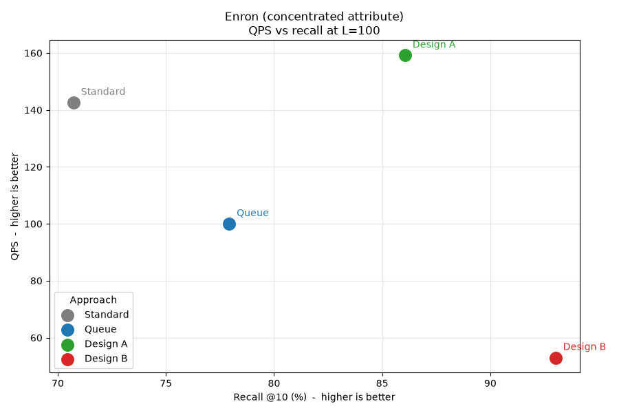
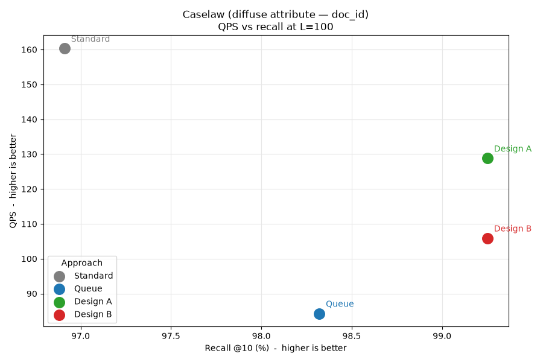
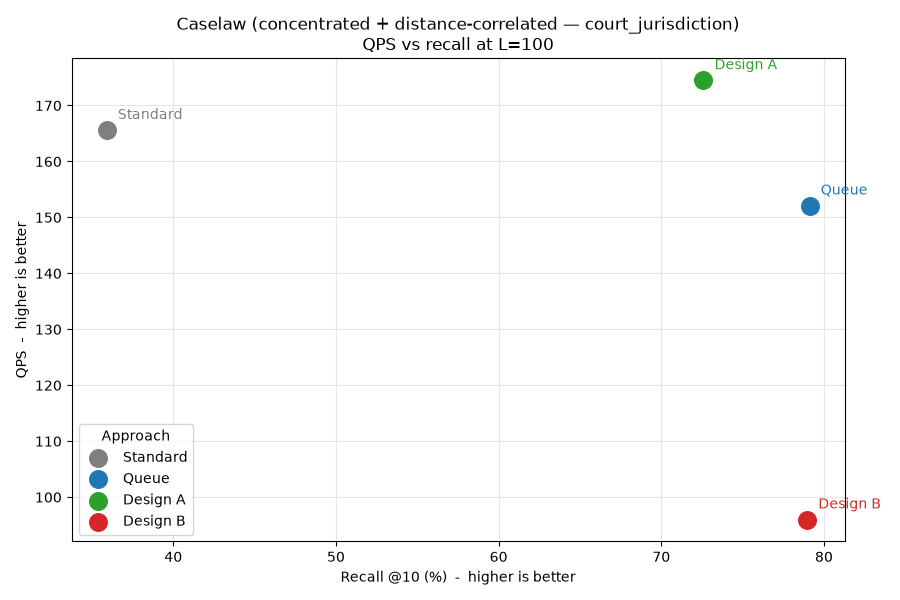
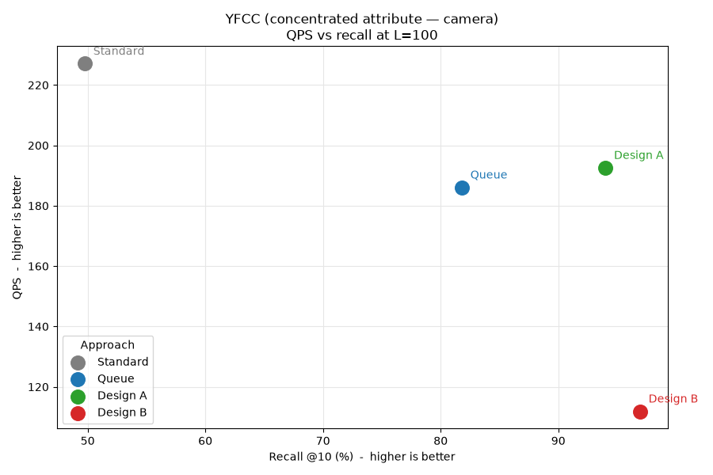

# Attribute-Diversity Search — Benchmark Results

Comparison of attribute-bucket diverse search strategies across several dataset
and attribute regimes, all
evaluated against a **diverse ground truth** (GT built so that no more than
`diverse_results_k` results share the same attribute bucket).

## Setup

Common parameters for every run below:

| Parameter | Value |
|---|---|
| Index | On-disk DiskANN, 200,000 base vectors |
| `recall_at` (k) | 10 |
| `diverse_results_k` | 1 (at most one result per attribute bucket) |
| `beam_width` | 4 |
| `num_threads` | 1 |
| Distance | squared L2 |
| Search lists (L) | 20, 40, 80, 100 |
| Ground truth | diverse GT (`groundtruth_diverse_k100.bin`) |

> **QPS methodology.** Recall, IO counts, comparisons and hops are exact and
> fully reproducible. QPS, however, is single-threaded and disk-bound, and on the
> dev machine used here (shared with VS Code, browsers, Teams) it varied 10–30×
> run-to-run purely from disk-wait contention, with IO counts unchanged. The QPS
> figures below are the **best (least-contended) of several runs per cell**,
> which is closest to the true compute-/IO-bound cost. Treat QPS as indicative,
> not precise; the recall and IO columns are the authoritative comparison.

### Datasets

| Dataset | Dim | Diversity attribute | Attribute character |
|---|---|---|---|
| Enron | 1,369 | attribute id 0 | **Concentrated** — many vectors share a bucket |
| Caselaw | 1,536 | `doc_id` | **Diffuse, uncorrelated** — 200K vectors span 172,518 docs (18,383 multi-chunk) |
| Caselaw | 1,536 | `court_jurisdiction` | **Concentrated + distance-correlated** — 60 courts, largest bucket 47,358 (23.7%), median 1,668 |
| YFCC | 192 | `camera` model | **Concentrated, ~uncorrelated** — 67 distinct cameras, largest bucket 67,783 (33.9%), median bucket 110 |

Two axes matter for diversity search: how **concentrated** the buckets are (does
the sampler need to over-fetch?) and how **correlated** the attribute is with
distance (are same-bucket vectors clustered together in the search pool?). The
caselaw `court_jurisdiction` attribute is the interesting case: cases from the
same court share citations and legal boilerplate, so their embeddings cluster —
the attribute is *both* concentrated and strongly correlated with distance.

### Strategies compared

- **Standard** — plain KNN search (no diversity enforcement), scored against the
  diverse GT. Shows how far an ordinary search is from the diverse target.
- **Queue** — diversity enforced *during* graph traversal using a diversity-aware
  neighbor queue with approximate (PQ) distances. Branch
  `u/narendatha/diverse-search-benchmark`.
- **Design A (post-process)** — plain KNN over the top-L pool, then a greedy
  bucket selection keeping ≤ `diverse_results_k` per bucket, using
  full-precision distances. Fixed L (no over-fetch).
- **Design B (adaptive-L)** — like Design A, but a greedy walk first samples
  bucket concentration; if buckets are concentrated it grows L (over-fetches)
  before the same post-processing step. When buckets are diffuse it returns a 1×
  multiplier and behaves exactly like Design A.

---

## Enron (concentrated attribute)

| L | Standard recall | Queue recall | Design A recall | Design B recall | Std QPS | Queue QPS | A QPS | B QPS |
|---|---|---|---|---|---|---|---|---|
| 20 | 55.71 | 61.11 | 59.98 | **79.92** | 375.5 | 261 | 542.9 | 385.6 |
| 40 | 64.28 | 71.08 | 73.93 | **87.38** | 245.3 | 221 | 268.0 | 183.2 |
| 80 | 69.67 | 76.46 | 84.00 | **92.12** | 173.2 | 116 | 165.6 | 107.2 |
| 100 | 70.72 | 77.92 | 86.05 | **93.01** | 142.6 | 100 | 159.2 | 53 |

**QPS vs recall @ L=100** (up and to the right is better)

**Observations**
- Standard search is far below every diversity-aware method (it does not enforce
  the one-per-bucket constraint), confirming the diverse GT is meaningfully
  different from ordinary top-k.
- **Design B wins recall at every L** (+19 over queue at L=20), because the
  attribute is concentrated: the adaptive sampler detects this and over-fetches a
  larger pool before reranking.
- Design A beats the queue on both recall and QPS at every L.
- Design B carries a throughput cost (extra pool fetch + more IO), but delivers
  the highest recall. At L=100 its IO count (320) is well over double Design A's
  (112), so its lower QPS there is real, not measurement noise.
- Pareto note: Design B @ L=20 (79.9 recall) beats Design A @ L=40 (73.9 recall)
  at comparable throughput.

---

## Caselaw (diffuse, uncorrelated attribute — `doc_id`)

| L | Standard recall | Queue recall | Design A recall | Design B recall | Std QPS | Queue QPS | A QPS | B QPS |
|---|---|---|---|---|---|---|---|---|
| 20 | 90.61 | 90.76 | 92.04 | 92.04 | 554.8 | 306.7 | 448.8 | 238.4 |
| 40 | 95.43 | 96.53 | 97.53 | 97.53 | 267.5 | 207.0 | 192.5 | 151.0 |
| 80 | 96.73 | 98.13 | 99.06 | 99.06 | 187.0 | 138.4 | 132.4 | 101.3 |
| 100 | 96.91 | 98.32 | 99.25 | 99.25 | 160.3 | 84.3 | 128.8 | 105.9 |

**QPS vs recall @ L=100** (up and to the right is better)

**Observations**
- **Design A and Design B have identical recall AND identical IO/comparison/hop
  counts.** The `doc_id` attribute is so diffuse (almost every vector is its own
  bucket) that the concentration sampler returns a 1× multiplier — Design B
  performs no over-fetch. Its slightly lower QPS is the pure cost of the
  concentration-sampling walk, which here yields no benefit.
- Even standard search is already close to the diverse GT here, because with
  near-unique buckets the diverse GT is almost the same as the ordinary top-k.
  The diversity methods add only ~1–2 recall points.
- Design A/B edge out the queue method on recall (~1–1.3 points) via
  exact-distance reranking, and Design A is also competitive on QPS
  (e.g. 448.8 vs queue 306.7 at L=20).

---

## Caselaw (concentrated + distance-correlated attribute — `court_jurisdiction`)

Same 200K caselaw vectors and index as above, but the diversity attribute is now
the natural `court_jurisdiction` field (60 US courts) instead of `doc_id`. This
attribute is **both** concentrated (largest bucket 23.7%, median 1,668) **and
strongly correlated with distance** — cases from the same court cluster together
in embedding space. This is the hardest and most realistic regime: a query's
nearest neighbors are dominated by a few jurisdictions, so enforcing one-per-bucket
forces the search to reach far past the plain top-L pool.

| L | Standard recall | Queue recall | Design A recall | Design B recall | Std QPS | Queue QPS | A QPS | B QPS |
|---|---|---|---|---|---|---|---|---|
| 20 | 34.74 | 71.35 | 46.30 | 57.30 | 387.9 | 434.9 | 413.5 | 317.1 |
| 40 | 35.37 | 76.19 | 59.68 | 68.23 | 394.3 | 278.7 | 303.8 | 203.3 |
| 80 | 35.79 | 78.72 | 69.74 | 76.62 | 212.2 | 176.4 | 211.1 | 114.2 |
| 100 | 35.91 | 79.12 | 72.59 | 78.97 | 165.6 | 152.1 | 174.5 | 96.0 |

**QPS vs recall @ L=100** (up and to the right is better)

**Observations**
- **This regime inverts the earlier ranking: the queue beats Design A at every L**
  (e.g. 71.4 vs 46.3 at L=20). When the attribute is correlated with distance, the
  plain top-L pool that Design A reranks is *saturated* with the dominant
  jurisdictions, so no amount of exact-distance reranking can recover the missing
  buckets. The queue enforces diversity *during* traversal, steering the walk out
  of the dominant cluster early — exactly what post-processing cannot do.
- **Design B recovers most of the gap** via adaptive over-fetch (57.3 vs A's 46.3
  at L=20) but stays just below the queue at every L, including L=100 (79.0 vs
  79.1) — and only closes this much by fetching a larger pool (IO 193 vs queue's
  114), so its QPS is the lowest of all methods there. On the QPS-vs-recall plot
  the queue **dominates Design B** (equal-or-better recall at ~1.6× the
  throughput).
- Standard search collapses to ~35% and never improves with L — with buckets both
  concentrated and distance-correlated, the ordinary top-k is almost entirely the
  wrong jurisdictions.
- Takeaway: **for a distance-correlated attribute, in-traversal diversity (queue)
  is the efficient choice; post-processing (Design A/B) must over-fetch heavily to
  compete, and even then only approaches — never beats — the queue on the
  recall/QPS frontier.** This is the opposite of the uncorrelated concentrated
  case (YFCC) where Design B is the clear winner.

---

## YFCC (concentrated attribute — `camera` model)

YFCC-100M image embeddings (200K subset, 192-dim). The diversity attribute is the
`camera` model tag: 67 distinct cameras, but very skewed — the largest bucket holds
33.9% of all vectors and the median bucket only 110, so this is a strongly
concentrated regime (like Enron).

| L | Standard recall | Queue recall | Design A recall | Design B recall | Std QPS | Queue QPS | A QPS | B QPS |
|---|---|---|---|---|---|---|---|---|
| 20 | 49.35 | 79.26 | 66.92 | **88.44** | 347.0 | 592.6 | 499.4 | 442.6 |
| 40 | 49.60 | 81.23 | 83.54 | **94.20** | 499.7 | 397.3 | 441.5 | 261.8 |
| 80 | 49.72 | 81.60 | 92.38 | **96.45** | 256.5 | 240.2 | 248.3 | 140.6 |
| 100 | 49.73 | 81.78 | 93.98 | **96.92** | 227.1 | 186.1 | 192.6 | 111.9 |

**QPS vs recall @ L=100** (up and to the right is better)

**Observations**
- Standard search is stuck at ~49.5 recall for every L — with a third of the
  corpus in one camera bucket, ordinary top-k returns many same-bucket neighbors
  that the diverse GT rejects. Growing L does not help it at all.
- **Design B wins recall at every L** (+9 to +15 over the queue), because the
  adaptive sampler detects the concentration and over-fetches before reranking.
- **The queue method plateaus at ~81%** — its approximate (PQ) in-traversal
  diversity saturates and extra L barely helps. Design A overtakes it from L=40
  onward and reaches 94% at L=100; Design B is ahead of the queue at every L.
- Design B's higher recall again costs throughput (its IO roughly triples by
  L=100: 286 vs Design A's 112), so its lower QPS is real work, not noise.
- Pareto note: Design B @ L=20 (88.4 recall) already beats Design A @ L=40
  (83.5) and the queue at any L, at competitive throughput.

---

## Summary

The datasets exercise the two axes that govern diverse search — bucket
**concentration** and attribute/distance **correlation**:

- **Concentrated, ~uncorrelated attribute (Enron, YFCC):** big win for Design B —
  adaptive over-fetch recovers substantial recall (+19 over queue on Enron at
  L=20; +13 on YFCC at L=40) at a throughput cost. On YFCC the queue method
  plateaus near 81% while Design B climbs to 97%.
- **Diffuse attribute (Caselaw `doc_id`):** the sampler detects abundant diversity
  and Design B performs no over-fetch — it matches Design A on recall and IO (its
  only cost is the sampling walk), and both slightly beat the queue method.
- **Concentrated + distance-correlated attribute (Caselaw `court_jurisdiction`):**
  the ranking *inverts*. Because same-bucket vectors cluster in distance, the plain
  top-L pool is saturated with the dominant buckets, so post-processing (Design A)
  falls far behind the queue (46 vs 71 recall at L=20). The queue enforces diversity
  during traversal and is the efficient choice; Design B claws back most of the gap
  via heavy over-fetch but stays just below the queue on recall (79.0 vs 79.1 at
  L=100) at ~1.6× the IO, so the queue dominates it on the recall/QPS frontier.

Recommendation: the best strategy depends on the attribute. For **concentrated,
distance-uncorrelated** attributes, **Design B** wins (adaptive over-fetch, no
per-dataset L tuning). For **distance-correlated** attributes, in-traversal
diversity (the **queue**) is more efficient than any post-processing approach —
diversity has to be enforced during the walk, not after it. Design A remains a
cheap, effective choice whenever the top-L pool already contains enough distinct
buckets (diffuse or weakly-correlated attributes).
