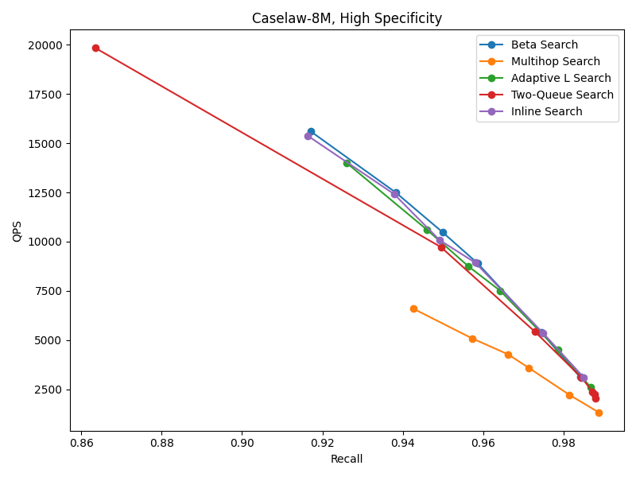
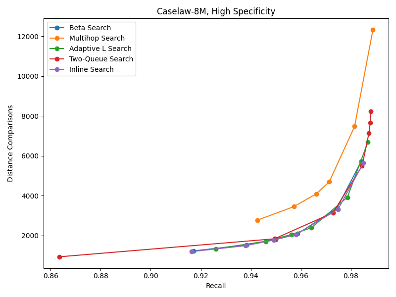
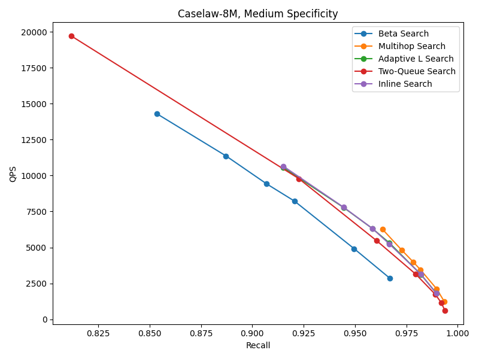
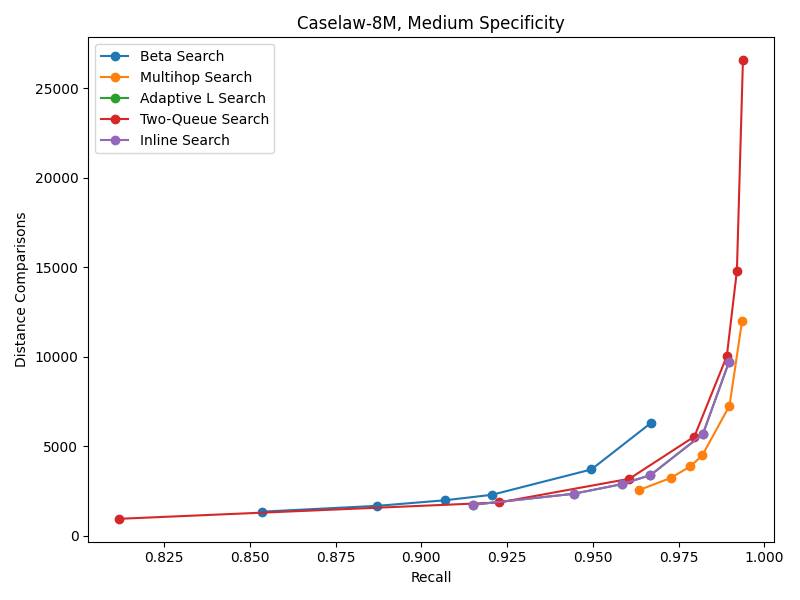
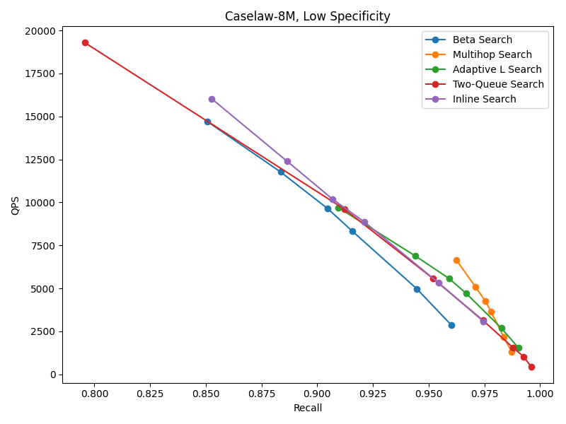
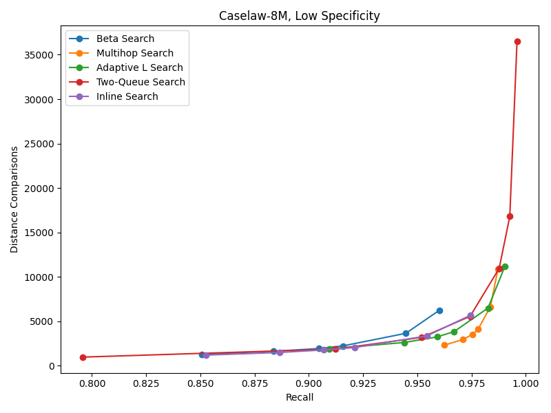

# Filtered Search Algorithms in DiskANN

| | |
|---|---|
| **Authors** | Magdalen Manohar |
| **Created** | 2026-06-02 |

## Summary and Motivation

There are currently two filtered search algorithms in DiskANN: beta-filtered search and multi-hop search. Each has performance drawbacks: beta-filtered search generally struggles to achieve high recall on our existing test datasets, and while multi-hop search generally achieves higher recall and fewer distance comparisons than beta-filtered search, it has low recall on certain datasets and can sometimes explore extremely large portions of the graph before converting.

At the same time, there are three other proposed filtered search algorithms that currently exist as branches or pull requests. We need to understand the performance of each candidate and align on a smaller set of well-performing algorithms to stand behind as our filtered algorithms for DiskANN.

This RFC presents an empirical evaluation of the existing algorithms and makes recommendations to keep two algorithms and close/deprecate the other filtered search algorithms.

### Overview of Existing Filtered Algorithms

#### Inline Filtered Search

Inline filtered search is a simple baseline which I introduced to sanity-check the other filtered search algorithms. It conducts a standard graph search with the only additional step of maintaining a separate queue of every predicate-satisfying element seen so far, and returning the closest $L_{search}$ predicate-satisfying elements at the end of the search. 

The branch implementing inline filtered search is here. 

#### Beta Search

Beta search is conceptually very simple. It sets a value $\beta \in (0,1]$, and for a point $p$ encountered during a graph search that satisfies the query filter, the raw distance between the query and $p$ is multiplied by β. Thus the search is biased towards points which satisfy the filter.

The code for beta search is found here.

##### Multihop Search

Multi-hop search augments the regular beam search with a step to gather additional candidates satisfying the filter at each visit, and it only inserts nodes satisfying the filter into the queue. During a visit, the nodes satisfying the predicate are added to the queue. The nodes that do not satisfy the predicate are expanded again, and if their neighbors satisfy the predicate, those neighbors have their distance to the query computed and are added to the exploration queue. Multi-hop differs from the other search algorithms in that it computes more label checks than distance comparisons.

The code for multihop search is found here.

##### Two-Queue Search (929)

Two-queue search maintains a queue of neighbors satisfying the filter predicate (size k*p), where p is a multiplicative factor set by the user, and a separate, unbounded size queue of the best neighbors found so far, regardless of predicate. The search proceeds as normal with the larger queue, adding any results satisfying the predicate to the filtered queue. The search terminates for one of four reasons: (1) when the closest unexplored node in the regular queue is further away from the query than the furthest node in the filter-satisfying queue, (2) when no candidates remain to visit, (3) the number of hops exceeds a user-set maximum, or (4) the QueryVisitDecision returns a termination. 
The code for two-queue search is found in this PR.

##### Adaptive L Search (977)

Adaptive L search runs a filtered search in the following way: for each query, it runs a standard search until the search has performed 1000 distance computations. Then, it computes what fraction of the points seen so far satisfy the filter predicate, and scales the L_search parameter up accordingly. See these lines for the exact scaling parameters. It only performs the adaptive scaling at one point during the search, so L_search is capped at 16 times the original value.

The code for adaptive L search was originally contributed in this PR. This branch integrates it into benchmark and keeps up-to-date with the main branch.

### Goals

The goal is to align on at most two filtered search algorithms to remain in the main branch of the DiskANN repository, based on performance evaluation of current candidates.

## Benchmark Results

This proposal is motivated by the following benchmark results on two open-source datasets.

For each dataset, the graph is built once and then all search algorithms are executed on that graph. The best β parameter for beta search for each query set was selected from the range of .5-.8.

### Caselaw

The caselaw dataset consists of about 8 million legal cases that were embedded using OpenAI's text-embedding-small model. They have filters consisting of the court type, court name, date range of the case, and court jurisdiction. They are separated into three specificity regimes with 10000 queries in each regime: .005-.01, .01-.1, and .1-.5.

   

   

   

### YFCC

The YFCC dataset consists of 10 million CLIP embeddings of images with single filters specifying the year the image was taken and the camera type. The query sets have single-filter queries and are separated into three specificity regimes: .0001-.001, .005-.037, and .114-.338. 

### Analysis of Benchmark results

## Proposal

Based on the benchmarking results and their analysis, I propose the following actions:
1. Move inline filtering to the main repo as a new filtered search algorithm, with the adaptive-L subroutine an option that can be enabled.
2. Deprecate beta-filtered search.
3. Retain multi-hop filtered search.
4. Close the PR with two-queue search.

  
    

Discussion
One of the most surprising insights from this data was that inline filtered search, which contains no optimizations other than storing any predicate-satisfying elements, is competitive with all of the filter-specific algorithms except beta search. While achieving slightly less accuracy than other filter-specific algorithms, it is still quite competitive. This suggests that existing filtered algorithms are either not taking advantage of correlations between filters, or that these correlations aren’t present enough to influence the results for these datasets. 
Multi-hop search generally performs fewer distance comparisons than other algorithms, at the cost of more bitmap comparisons. This suggests that it is most successful at using filter information in navigation, and perhaps that further optimizations could compound on this advantage. 
A previous version of this report contained some experiments suggesting that two-queue search always searched an enormous area in the graph before terminating. This was because the most important parameter controlling the two-queue search is the number of hops in the graph that it is allowed to perform, which I previously thought was just a failsafe against extremely low specificity filters. In fact, it is the main parameter controlling the QPS/recall tradeoff. However, in my opinion it is less ideal to rely on controlling the number of hops as opposed to mostly relying on a convergence criteria. My suggestion is that we should not merge two-queue search as it seems more difficult to configure and a combination of inline filtered search and adaptive l search gives similar performance.
Beta search. Beta search never achieves higher maximum recall than other types of search, and in most cases is also strictly slower in overlapping recall ranges. This illustrates that algorithms that adaptively explore more candidates depending on predicate satisfaction perform better.
Initial Conclusions
This work supports the following initial conclusions:
	So far, there are no scenarios where beta search provides better performance than multi-hop or adaptive L search. Beta search should likely be deprecated
	Adaptive L search should be merged, with a flag that turns off the adaptive L feature and only performs an inline filtered search
Future Work
	Experiment with the Bing dataset
	Work is needed to parse out the differences further between multi-hop search and adaptive L search. In particular, it may be possible to accelerate multi-hop performance by adding some more controls on how many two-hop candidates are explored, using some of Yunan's ideas. It may also be possible to extend to more hops in the case of extremely low selectivity
