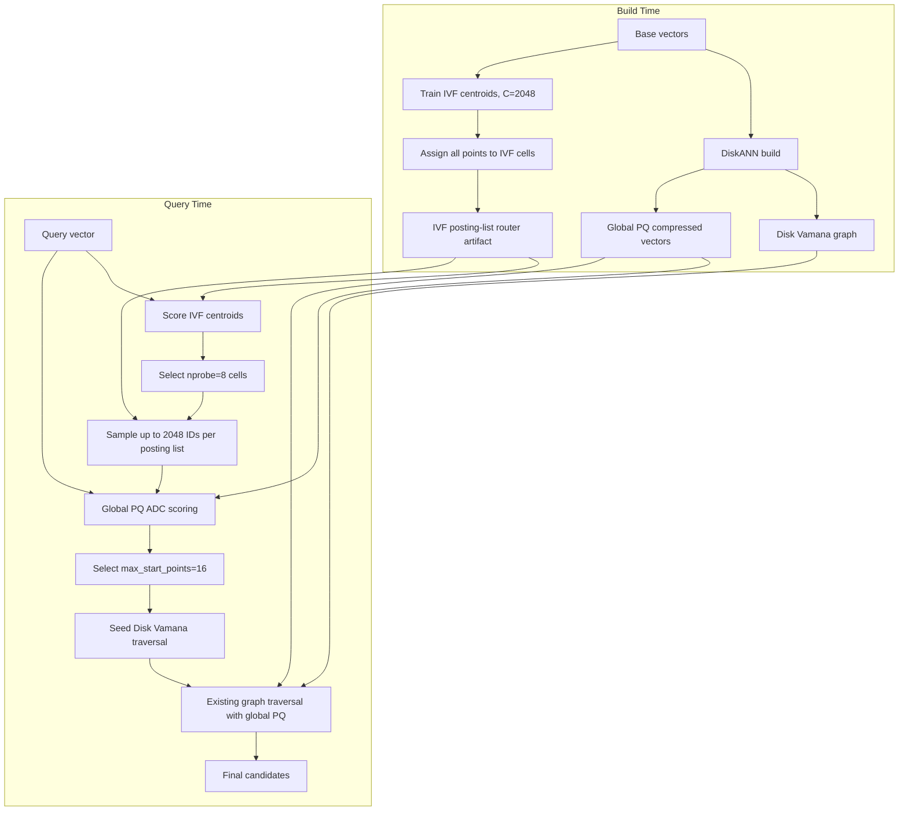

# RFC: IVF+PQ Posting-List Sampled ADC Start-Point Router

| | |
|---|---|
| Authors | Xiaowei Jiang, Codex |
| Created | 2026-07-28 |
| Status | Draft |
| Related docs | N/A |

## Summary

This RFC proposes **IVF+PQ posting-list sampled ADC routing** as the default experimental start-point router for the next phase of DiskANN disk Vamana research.

Recommended default configuration:

```json
{
  "type": "ivf_pq",
  "artifact": "outputs/msturingann10m_user_c2048.ivf_pq_router.bin",
  "nprobe": 8,
  "max_start_points": 16,
  "posting_list_samples_per_list": 2048
}
```

This design does not add residual PQ and does not duplicate PQ codes in a sidecar. It adds only an IVF posting-list artifact. At query time, it probes top IVF cells, samples up to 2048 point IDs from each probed posting list, scores those samples with the existing DiskANN global PQ ADC path, selects 16 query-specific start points, and then hands control to the existing disk Vamana traversal.

The recommendation is data-driven. On MSTuringANN 10M with `L=200` and `recall@100`, `sampled_adc_np8_s2048_msp16` improves recall by 3.46 points over baseline, reduces IOs/hops by 45.9%, reduces comparisons by 48.0%, keeps mean latency effectively unchanged, and improves p95 and p999 latency. It is the best balanced operating point from the current sweep.

## Background

The current DiskANN disk Vamana search path is:

1. Start from the medoid or a small fixed set of entry points.
2. Run best-first graph traversal.
3. Read disk graph adjacency lists.
4. Use in-memory global PQ compressed vectors to score neighbor IDs.
5. Continue frontier expansion until the `search_list` / beam condition is satisfied.

This path is robust: the disk graph format is mature, traversal is stable, and storage scales well. Its weakness is that query-agnostic entry points can waste early hops and IOs in graph regions that are far from the query.

The core hypothesis is:

```text
If a router can find query-relevant start points with bounded RAM and CPU cost,
Vamana traversal can reach better recall with fewer IOs, hops, and comparisons.
```

Previous directions included:

- IVF-only representatives: low memory, but not query-specific enough.
- IVF+global PQ flat scan: strong quality, but probing-list flat scan is not well controlled at larger scale.
- Block summary / block sampled ADC: useful for 1B scaling discussion, but simple summaries have not produced stable quality yet.
- Residual PQ: useful as an ablation, but it adds another per-point code layout and should not be the default path yet.

Posting-list sampled ADC is the pragmatic middle point: it preserves query-aware ADC start-point selection while bounding router scoring by `nprobe * posting_list_samples_per_list`.

## Architecture



## Recommended Design

### Default operating point

Default treatment:

| Parameter | Value |
|---|---:|
| IVF cells | 2048 |
| load mode | mmap |
| nprobe | 8 |
| posting_list_samples_per_list | 2048 |
| max_start_points | 16 |
| distance | squared_l2 |
| search_list L | 200 |
| recall_at | 100 |

Why this point:

1. `msp=16` is the strongest stable lever in the current sweep. Compared with `msp=8`, it usually adds 1.1 to 1.8 recall points and further reduces graph work.
2. `nprobe=8` keeps router CPU cost lower and avoids spreading the query over too many cells.
3. `sample=2048` bounds router ADC scoring at roughly 16K codes/query and is already sufficient to improve entry-point quality substantially.
4. It is the only treatment in this run that clearly improves recall and graph work without increasing mean latency.

### High-recall ablation

Keep `nprobe=16, sample=4096, msp=16` as the high-recall ablation.

This point produces the highest recall, but router cost and latency are much higher. It answers the quality-ceiling question for sampled ADC, but it is not the default system configuration.

## Evidence

Experiment setup:

| Item | Value |
|---|---|
| Dataset | MSTuringANN 10M |
| Data type / dim | float32 / 100 |
| Distance | squared_l2 |
| Disk index build | derived from `/Users/xiaoweijiang/Downloads/config_build.json` |
| Search config | derived from `/Users/xiaoweijiang/Downloads/config_search_l200_r100.json` |
| L | 200 |
| recall_at | 100 |
| beam_width | 64 |
| num_threads | 4 |
| num_nodes_to_cache | 50000 |
| IVF build | C=2048, training_sample_size=100000, max_iterations=4 |
| Raw report | prior local sweep, summarized here |

Core results:

| variant | recall@100 (%) | IOs / hops | comparisons | mean latency us | p95 us | p999 us | router us | router codes |
|---|---:|---:|---:|---:|---:|---:|---:|---:|
| baseline | 73.48 | 491.18 | 23360.02 | 1498.62 | 2056 | 9069 | 0.00 | 0.00 |
| sampled_adc_np8_s2048_msp16 | 76.94 | 265.77 | 12144.88 | 1498.45 | 1893 | 6845 | 610.28 | 16219.65 |
| sampled_adc_np8_s4096_msp16 | 77.38 | 262.79 | 11998.40 | 1948.32 | 2324 | 8823 | 1069.60 | 29970.23 |
| sampled_adc_np16_s4096_msp16 | 77.47 | 260.25 | 11871.79 | 2918.50 | 3342 | 9088 | 2076.44 | 59517.07 |
| scan_np16_scan65536_msp16 | 77.33 | 260.20 | 11870.72 | 3151.17 | 3607 | 7990 | 2271.79 | 65412.18 |

Recommended point versus baseline:

| metric | baseline | recommended | delta |
|---|---:|---:|---:|
| recall@100 | 73.48% | 76.94% | +3.46 points |
| IOs / hops | 491.18 | 265.77 | -225.41, -45.9% |
| comparisons | 23360.02 | 12144.88 | -11215.14, -48.0% |
| mean latency | 1498.62 us | 1498.45 us | -0.17 us, ~0.0% |
| p95 latency | 2056 us | 1893 us | -163 us, -7.9% |
| p999 latency | 9069 us | 6845 us | -2224 us, -24.5% |

Interpretation:

- Headline metrics are recall@100, IOs/hops, comparisons, latency, p95, and p999.
- `sampled ADC codes` is a router CPU diagnostic. It is not the headline outcome.
- Local machine latency can be affected by thermals, background load, and cache state. Therefore, this RFC prioritizes recall, IOs/hops, and comparisons as the more stable decision metrics, then uses latency to check whether system cost is under control.
- `sampled_adc_np8_s2048_msp16` is valuable because roughly 16K sampled ADC codes/query nearly halves graph traversal work without an observed mean-latency regression.
- `sampled_adc_np16_s4096_msp16` adds only 0.53 recall points over the default point, but increases router codes from roughly 16K to roughly 60K and almost doubles mean latency. It is a high-recall ablation, not the default.
- The high-recall flat-scan point is close in recall to sampled ADC high-recall, but it has higher router latency and a less scalable probed-list scan budget.

## Build Artifact

The IVF+PQ router artifact owns only IVF centroids and posting IDs:

```text
dim
centroids:   C * dim * f32
offsets:     (C + 1) * usize
posting_ids: N * u32
fallback_medoid
```

Current MSTuringANN 10M artifact:

```text
outputs/msturingann10m_user_c2048.ivf_pq_router.bin
```

Approximate in-process bytes after the current implementation loads the artifact, excluding allocator overhead:

| component | 10M, C=2048, dim=100 | 1B, C=2048, dim=100 |
|---|---:|---:|
| centroids | 0.78 MiB | 0.78 MiB |
| offsets | 16 KiB | 16 KiB |
| posting_ids | 38.15 MiB | 3.73 GiB |

Notes:

- Posting IDs cost `4 * N` bytes. They must be included in IVF memory accounting.
- The minimal implementation in this PR loads centroids, offsets, and posting IDs into process memory. mmap loading is future scaling work.
- This RFC does not add residual PQ codes, so it does not add `N * M_res` bytes.
- DiskANN's existing global PQ compressed vectors are still used by traversal. The sampled ADC router reuses them, so they are not counted as incremental router memory.

## Query Algorithm

Inputs:

```text
query q
IVF centroids
IVF posting lists
global PQ code view
nprobe = 8
posting_list_samples_per_list = 2048
max_start_points = 16
```

Flow:

1. Score all IVF centroids against `q`.
2. Use bounded top-k selection to choose the top `nprobe` cells.
3. For each selected cell, take at most `posting_list_samples_per_list` sample IDs from the posting list.
4. Reuse the existing global PQ ADC path to compute query-aware approximate distances for sampled IDs.
5. Select the top `max_start_points` across all samples.
6. Deduplicate and fall back to the medoid if needed.
7. Use those IDs as initial entry points for disk Vamana traversal.
8. Keep graph traversal, disk IO, and PQ neighbor scoring unchanged.

Complexity:

```text
centroid scoring: O(C * dim)
router ADC scoring upper bound: O(nprobe * posting_list_samples_per_list * pq_chunks)
graph traversal: unchanged, but starts from better points
```

With the default configuration:

```text
8 * 2048 = 16384 PQ codes / query
```

This is much more controllable than a full flat scan over probed posting lists, especially as N grows.

## Why Not Flat Scan

On the 10M, C=2048, nprobe=16 setting, the high-recall flat-scan row is effective:

```text
scan_np16_scan65536_msp16:
recall@100 = 77.33
IOs = 260.20
comparisons = 11870.72
mean latency = 3151.17 us
router scanned codes = 65412.18
```

It is not the default because:

1. Mean latency is 110.3% higher than baseline and about 2.1x higher than the recommended sampled ADC point.
2. Its scan budget is tied to probed-list length and becomes harder to control as N grows.
3. Sampled ADC gets 76.94 recall with roughly 16K codes, improves recall by 3.46 points, and keeps latency flat.
4. High-recall sampled ADC reaches 77.47 recall with roughly 60K codes, slightly above the high-recall flat-scan point.

Flat scan should remain a quality upper-bound / ablation, not the scaling path.

## Why Not Residual PQ

Residual PQ has a clear benefit: points inside an IVF cell can be represented with residual encodings, which should be better suited for cell-local ADC.

It is not the default for now:

1. It adds `N * M_res` residual codes, increasing query-time memory.
2. DiskANN traversal already needs global PQ vectors. Adding residual PQ creates two long-lived PQ code layouts unless future work proves residual PQ can replace traversal PQ.
3. Current experiments show that reusing global PQ with sampled ADC already improves entry-point quality substantially.
4. Residual PQ is better kept as an ablation to test whether cell-local residual distances further improve routed start quality.

## Scaling Notes

The default design in this RFC solves the immediate problem of avoiding full flat scan inside probed IVF lists. It is not a complete 1B product architecture by itself.

Impact at 1B scale:

- If C stays at 2048, each posting list averages about 488K points. A flat scan with `nprobe=8` would touch about 3.9M points/query, which is not practical.
- Sampled ADC fixes scoring cost at `nprobe * sample`, for example 16K codes/query, instead of growing linearly with N.
- Posting IDs still cost `4 * N` bytes, roughly 3.73 GiB at 1B. mmap improves load shape, but does not remove total data size.
- Global PQ vectors are still the larger query-time memory component. With 64 PQ chunks, 1B raw PQ codes are about 64 GiB.

Further work needed for 1B:

1. Hierarchical IVF centroid probing, to avoid flat scanning too many centroids.
2. Posting-order canonical PQ layout, to reduce random gather and duplicate PQ layouts.
3. Shard-aware / tiered router artifacts, keeping cold postings and PQ codes in mmap / SSD-friendly layouts.
4. A sampling strategy that evolves from fixed prefix/sample to workload-aware or learned sampling.
5. Linux/x86_64 smaps-level memory audits, separating heap, anonymous RSS, and file-backed RSS.

## Benchmark Plan

Default regression benchmark:

```text
dataset: MSTuringANN 10M
L: 200
recall_at: 100
distance: squared_l2
beam_width: 64
num_nodes_to_cache: 50000
baseline: start_point_router = null
treatment: nprobe=8, posting_list_samples_per_list=2048, max_start_points=16
high-recall ablation: nprobe=16, posting_list_samples_per_list=4096, max_start_points=16
```

Required metrics:

- recall@100
- IOs / hops
- comparisons
- mean latency
- p95 / p999 latency
- router time
- sampled ADC codes
- query-time memory / RSS audit, if the environment supports it

Decision order:

1. Does treatment improve recall?
2. Do IOs/hops/comparisons decrease?
3. Are latency, p95, and p999 within budget?
4. Do router sampled codes explain CPU cost?
5. Does memory fit the target scale budget?

## Rollout

Phase 1: keep the current implementation as a benchmark opt-in path.

- Baseline remains unchanged.
- Sampled ADC is enabled only when `start_point_router.type = ivf_pq` and `posting_list_samples_per_list` is configured.
- Flat scan and residual PQ remain ablations.

Phase 2: add stability validation.

- Repeat the default point to verify latency is not an artifact of local machine state.
- Run 10M multi-dataset comparisons, especially clustered and non-clustered datasets.
- Add memory audit.

Phase 3: scaling path.

- Design hierarchical IVF + sampled ADC for 100M/1B.
- Optimize posting-order PQ layout.
- Add mmap artifact loading and validate file-backed page behavior and IO patterns.

## Open Questions

1. Is the current sampling strategy stable enough, or do we need deterministic dispersed sampling / learned sampling?
2. Is `nprobe=8, sample=2048, msp=16` still the best balanced point on clustered datasets?
3. Should the next sweep include `msp=12` or `msp=24` to validate the boundary around `msp=16`?
4. Can posting-order canonical PQ layout remove most global-PQ random gather cost?
5. At 1B scale, does the router artifact need mmap or a hierarchical router to control RSS and page fault patterns?

## Decision

Adopt `IVF+PQ posting-list sampled ADC` as the default experimental design for the next phase. The recommended default point is:

```text
C=2048
nprobe=8
posting_list_samples_per_list=2048
max_start_points=16
L=200
recall_at=100
```

`nprobe=16, sample=4096, msp=16` remains the high-recall ablation. Flat scan and residual PQ remain comparison experiments, not the default path.
