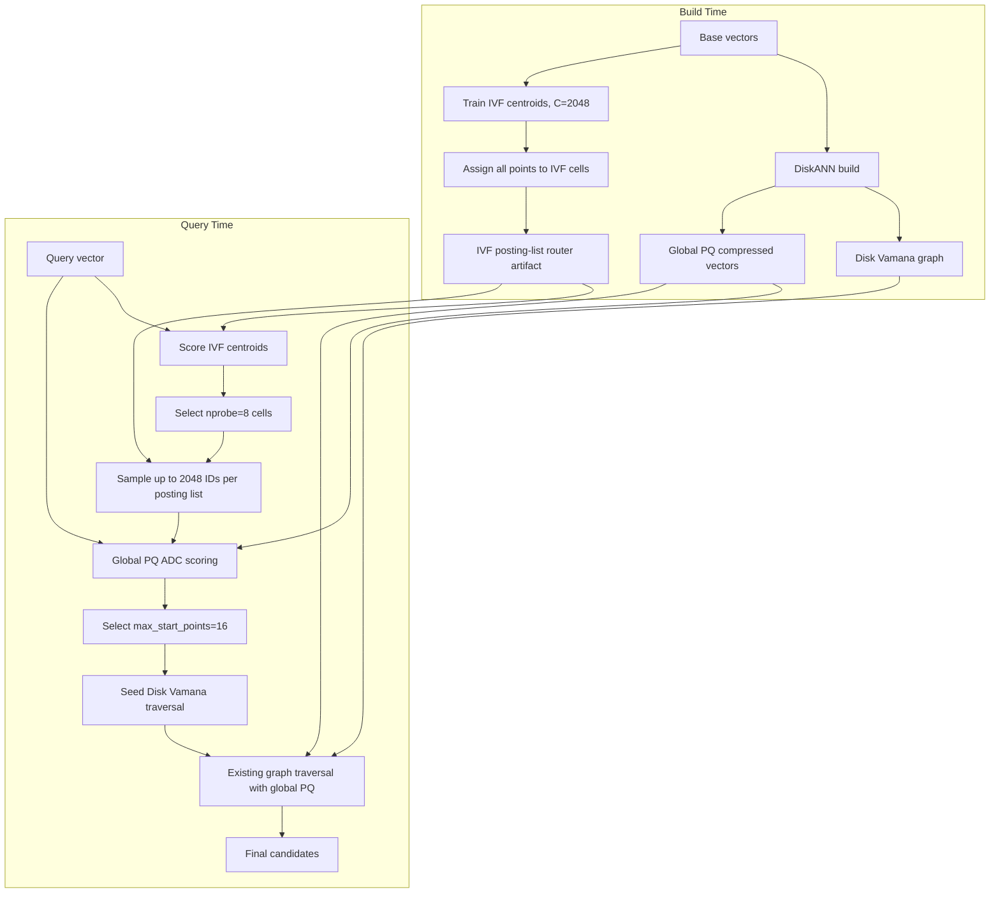

# RFC: IVF+PQ Posting-List Sampled ADC Start-Point Router

| | |
|---|---|
| 作者 | Xiaowei Jiang, Codex |
| 创建时间 | 2026-07-28 |
| 状态 | Draft |
| 相关文档 | N/A |

## 摘要

本文提议把 **IVF+PQ posting-list sampled ADC router** 作为下一阶段 DiskANN disk Vamana start-point router 的默认实验方案。

推荐默认配置：

```json
{
  "type": "ivf_pq",
  "artifact": "outputs/msturingann10m_user_c2048.ivf_pq_router.bin",
  "nprobe": 8,
  "max_start_points": 16,
  "posting_list_samples_per_list": 2048
}
```

这个方案不引入 residual PQ，也不复制一份 PQ code sidecar。它只新增一个 IVF posting-list artifact，query 时先选择 top IVF cells，然后在每个 probed posting list 内抽样最多 2048 个点，用 DiskANN 已有 global PQ ADC 估距，选出 16 个 query-specific start points，再交给现有 disk Vamana traversal。

推荐该配置的主要原因是数据驱动的：在 MSTuringANN 10M、`L=200`、`recall@100` 实验中，`sampled_adc_np8_s2048_msp16` 相比 baseline recall 提升 3.46 points，IO/hops 降低 45.9%，comparisons 降低 48.0%，mean latency 基本不变，p95 和 p999 还更低。它是当前 sweep 中最适合做默认实验点的 balanced operating point。

## 背景

DiskANN disk Vamana search 的主路径是：

1. 从 medoid 或少量固定入口点开始。
2. 执行 best-first graph traversal。
3. 读 disk graph adjacency。
4. 用内存中的 global PQ compressed vectors 对 neighbor 做近似距离估计。
5. 持续扩展 frontier，直到满足 `search_list` / beam 条件。

这个路径的强项是 graph traversal 稳定、图格式成熟、磁盘存储可扩展。弱点是入口点不够 query-aware 时，早期 hops 和 IO 可能浪费在离 query 较远的图区域。

本 RFC 的核心假设是：

```text
如果 router 能用有限 RAM/CPU 预算为 query 找到更接近真实邻域的多个 start points，
Vamana traversal 可以用更少 IO、hops、comparisons 达到更高 recall。
```

之前尝试过的路线包括：

- IVF-only representatives：内存低，但入口点不够 query-specific。
- IVF+global PQ flat scan：质量高，但 probed lists 内 flat scan 对大规模数据不够可控。
- block summary / block sampled ADC：有助于 1B scaling 讨论，但当前简单 summary 质量不稳定。
- residual PQ：可以做 ablation，但会新增一整份 per-point code，不适合作为默认第一路线。

posting-list sampled ADC 是当前更务实的中间点：保留 query-specific ADC selection，同时把 router scoring 上界控制为 `nprobe * posting_list_samples_per_list`。

## 架构图



## 推荐方案

### 默认实验点

默认 treatment：

| 参数 | 值 |
|---|---:|
| IVF cells | 2048 |
| load mode | mmap |
| nprobe | 8 |
| posting_list_samples_per_list | 2048 |
| max_start_points | 16 |
| distance | squared_l2 |
| search_list L | 200 |
| recall_at | 100 |

选择这个点的原因：

1. `msp=16` 是当前 sweep 中最稳定的收益来源。相比 `msp=8`，它通常提升 1.1 到 1.8 recall points，并继续降低 graph work。
2. `nprobe=8` 保持 router CPU 预算较低，避免把 query 扩散到过多 cells。
3. `sample=2048` 把 router ADC scoring 控制在约 16K codes/query，在本机实验里已经足够提供明显入口质量收益。
4. 它是本轮数据中唯一一个“recall 和 graph work 明显改善，同时 mean latency 没有增加”的 treatment。

### High-recall ablation

保留 `nprobe=16, sample=4096, msp=16` 作为 high-recall ablation。

这个点给出最高 recall，但 router cost 和 latency 明显更高。它适合回答“sampled ADC 质量上限接近哪里”，不适合作为默认系统配置。

## 数据依据

实验条件：

| 项目 | 值 |
|---|---|
| Dataset | MSTuringANN 10M |
| Data type / dim | float32 / 100 |
| Distance | squared_l2 |
| Disk index build | `/Users/xiaoweijiang/Downloads/config_build.json` 派生 |
| Search config | `/Users/xiaoweijiang/Downloads/config_search_l200_r100.json` 派生 |
| L | 200 |
| recall_at | 100 |
| beam_width | 64 |
| num_threads | 4 |
| num_nodes_to_cache | 50000 |
| IVF build | C=2048, training_sample_size=100000, max_iterations=4 |
| Raw report | prior local sweep, summarized here |

核心结果：

| variant | recall@100 (%) | IOs / hops | comparisons | mean latency us | p95 us | p999 us | router us | router codes |
|---|---:|---:|---:|---:|---:|---:|---:|---:|
| baseline | 73.48 | 491.18 | 23360.02 | 1498.62 | 2056 | 9069 | 0.00 | 0.00 |
| sampled_adc_np8_s2048_msp16 | 76.94 | 265.77 | 12144.88 | 1498.45 | 1893 | 6845 | 610.28 | 16219.65 |
| sampled_adc_np8_s4096_msp16 | 77.38 | 262.79 | 11998.40 | 1948.32 | 2324 | 8823 | 1069.60 | 29970.23 |
| sampled_adc_np16_s4096_msp16 | 77.47 | 260.25 | 11871.79 | 2918.50 | 3342 | 9088 | 2076.44 | 59517.07 |
| scan_np16_scan65536_msp16 | 77.33 | 260.20 | 11870.72 | 3151.17 | 3607 | 7990 | 2271.79 | 65412.18 |

默认推荐点相对 baseline 的变化：

| metric | baseline | recommended | delta |
|---|---:|---:|---:|
| recall@100 | 73.48% | 76.94% | +3.46 points |
| IOs / hops | 491.18 | 265.77 | -225.41, -45.9% |
| comparisons | 23360.02 | 12144.88 | -11215.14, -48.0% |
| mean latency | 1498.62 us | 1498.45 us | -0.17 us, ~0.0% |
| p95 latency | 2056 us | 1893 us | -163 us, -7.9% |
| p999 latency | 9069 us | 6845 us | -2224 us, -24.5% |

解读：

- Headline metrics 应看 recall@100、IOs/hops、comparisons、latency/p95/p999。
- `sampled ADC codes` 是 router CPU 诊断指标，不是主结论。
- 本机 latency 会受散热、后台程序、cache state 影响；因此 RFC 把 recall、IO/hops、comparisons 作为更稳定的决策依据，再用 latency 判断系统代价是否失控。
- `sampled_adc_np8_s2048_msp16` 的关键价值是：以约 16K sampled ADC codes 的 router cost，把 graph traversal work 接近腰斩，并且没有观察到 mean latency 回退。
- `sampled_adc_np16_s4096_msp16` 只比默认点多 0.53 recall points，但 router codes 从约 16K 增到约 60K，mean latency 接近翻倍。因此它是 high-recall ablation，不是默认点。
- flat scan high-recall 点和 sampled ADC high-recall 点 recall 接近，但 flat scan router latency 更高，且 probed-list scan budget 更难向 1B 扩展。

## Build Artifact

IVF+PQ router artifact 只负责存 IVF centroids 和 posting IDs：

```text
dim
centroids:   C * dim * f32
offsets:     (C + 1) * usize
posting_ids: N * u32
fallback_medoid
```

当前 MSTuringANN 10M artifact：

```text
outputs/msturingann10m_user_c2048.ivf_pq_router.bin
```

当前实现加载 artifact 后的近似 in-process bytes，不含 allocator overhead：

| component | 10M, C=2048, dim=100 | 1B, C=2048, dim=100 |
|---|---:|---:|
| centroids | 0.78 MiB | 0.78 MiB |
| offsets | 16 KiB | 16 KiB |
| posting_ids | 38.15 MiB | 3.73 GiB |

注意：

- posting IDs 是 `4 * N` bytes，这是之前讨论 IVF 内存时必须计入的部分。
- 这个 PR 的最小实现直接把 centroids、offsets 和 posting IDs 载入进程内存；mmap load mode 属于后续 scaling work。
- 本 RFC 不新增 residual PQ codes，因此不会额外增加 `N * M_res` bytes。
- DiskANN 已有 global PQ compressed vectors 仍由 traversal 使用；sampled ADC router 只是复用它，不把它算作新增 router memory。

## Query Algorithm

输入：

```text
query q
IVF centroids
IVF posting lists
global PQ code view
nprobe = 8
posting_list_samples_per_list = 2048
max_start_points = 16
```

流程：

1. 对所有 IVF centroids 计算 `distance(q, centroid)`。
2. 用 bounded top-k selection 选择 top `nprobe` cells。
3. 对每个 selected cell，从 posting list 里取最多 `posting_list_samples_per_list` 个 sample IDs。
4. 对 sample IDs 复用 existing global PQ ADC，计算 query-aware approximate distance。
5. 在所有 sampled IDs 中选 top `max_start_points`。
6. 去重，必要时用 medoid fallback。
7. 把这些 IDs 作为 Disk Vamana traversal 的初始入口。
8. 后续 graph traversal、disk IO、PQ neighbor scoring 保持不变。

复杂度：

```text
centroid scoring: O(C * dim)
router ADC scoring upper bound: O(nprobe * posting_list_samples_per_list * pq_chunks)
graph traversal: unchanged, but starts from better points
```

默认配置下 router ADC 上界约为：

```text
8 * 2048 = 16384 PQ codes / query
```

这比对 probed lists 做 full flat scan 更可控，尤其是当 N 增长时。

## 为什么不是 Flat Scan

在 10M、C=2048、nprobe=16 的 setting 下，flat scan high-recall 点确实有效：

```text
scan_np16_scan65536_msp16:
recall@100 = 77.33
IOs = 260.20
comparisons = 11870.72
mean latency = 3151.17 us
router scanned codes = 65412.18
```

但它不是默认方案，原因是：

1. mean latency 比 baseline 高 110.3%，比推荐 sampled ADC 点高约 2.1x。
2. 它的 scan budget 和 probed-list 长度绑定，N 变大时更容易失控。
3. sampled ADC 用约 16K codes 已经拿到 76.94 recall，比 baseline 高 3.46 points，并保持 latency 不变。
4. high-recall sampled ADC 用约 60K codes 达到 77.47 recall，已经略高于 flat scan high-recall 点。

因此 flat scan 应保留为 quality upper-bound / ablation，而不是 scaling path。

## 为什么不是 Residual PQ

Residual PQ 的好处是每个 IVF cell 内的点可以用 residual encoding 表达，理论上更适合 cell-local ADC。

但当前默认不选 residual PQ：

1. 它需要新增 `N * M_res` residual codes，query-time memory 比 sampled ADC 方案高。
2. DiskANN traversal 已经需要 global PQ vectors。新增 residual PQ 会造成两套 PQ code 长期共存，除非未来证明它能替代 traversal PQ。
3. 当前实验已经证明复用 global PQ sampled ADC 足以显著改善入口质量。
4. residual PQ 更适合作为 ablation：验证 cell-local residual distance 是否能继续提升 routed start quality。

## Scaling Notes

本 RFC 的默认方案解决的是“不要在 probed IVF lists 里 full flat scan”的问题，而不是一次性完成 1B 产品化。

对 1B 的影响：

- 如果 C 固定为 2048，平均每个 posting list 约 488K points，flat scan `nprobe=8` 会触达约 3.9M points/query，不现实。
- sampled ADC 把 scoring 上界固定到 `nprobe * sample`，例如 16K codes/query，不随 N 线性增长。
- 但 posting IDs 仍然是 `4 * N` bytes，1B 约 3.73 GiB。使用 mmap 可以改善加载形态，但不消除总数据规模。
- global PQ vectors 仍是更大的 query-time memory 主体。例如 64 PQ chunks 时，1B raw PQ codes 约 64 GiB。

后续要让系统更适合 1B，需要继续探索：

1. hierarchical IVF centroid probing，避免 flat scan 过多 centroids。
2. posting-order canonical PQ layout，减少 random gather 和重复 PQ code layout。
3. shard-aware / tiered router artifact，把 cold postings 和 PQ codes 留在 mmap / SSD friendly layout。
4. sample strategy 从固定 prefix/sample 演进为 workload-aware 或 learned sample。
5. Linux/x86_64 smaps 级 memory audit，把 heap、anonymous RSS、file-backed RSS 拆开看。

## Benchmark Plan

默认回归 benchmark：

```text
dataset: MSTuringANN 10M
L: 200
recall_at: 100
distance: squared_l2
beam_width: 64
num_nodes_to_cache: 50000
baseline: start_point_router = null
treatment: nprobe=8, posting_list_samples_per_list=2048, max_start_points=16
high-recall ablation: nprobe=16, posting_list_samples_per_list=4096, max_start_points=16
```

必须记录：

- recall@100
- IOs / hops
- comparisons
- mean latency
- p95 / p999 latency
- router time
- sampled ADC codes
- query-time memory / RSS audit, 如果实验环境支持

判断顺序：

1. treatment 是否提升 recall。
2. IOs/hops/comparisons 是否下降。
3. latency/p95/p999 是否在可接受范围内。
4. router sampled codes 是否解释了 CPU cost。
5. memory 是否符合规模预算。

## Rollout

阶段 1：保持当前实现为 benchmark opt-in path。

- 默认 baseline 不变。
- 只有配置 `start_point_router.type = ivf_pq` 且设置 `posting_list_samples_per_list` 时启用 sampled ADC。
- flat scan 和 residual PQ 保留为 ablation。

阶段 2：补齐稳定性验证。

- 重复运行默认点，确认 latency 不是偶然受本机状态影响。
- 跑 10M 多数据集对比，尤其关注 clustered / non-clustered 数据。
- 增加 memory audit。

阶段 3：scaling path。

- 针对 100M/1B 设计 hierarchical IVF + sampled ADC。
- 优化 posting-order PQ layout。
- 增加 mmap artifact loading，并验证 file-backed page behavior 和 IO pattern。

## Open Questions

1. 当前 sample 选择策略是否足够稳定，还是需要 deterministic dispersed sampling / learned sampling？
2. `nprobe=8, sample=2048, msp=16` 在 clustered 数据集上是否仍是 best balanced point？
3. 是否需要把 `msp=12` 或 `msp=24` 加入 sweep，确认 `msp=16` 的边界？
4. posting-order PQ canonical layout 能否消除 global PQ random gather 的主要成本？
5. 在 1B 规模下，router artifact 是否需要 mmap 或分层 router 才能控制 RSS 和 page fault pattern？

## Decision

采用 `IVF+PQ posting-list sampled ADC` 作为下一阶段默认实验方案。默认推荐点是：

```text
C=2048
nprobe=8
posting_list_samples_per_list=2048
max_start_points=16
L=200
recall_at=100
```

`nprobe=16, sample=4096, msp=16` 作为 high-recall ablation；flat scan 和 residual PQ 保留为对照实验，不作为默认 path。
